# Frank (弗兰克) 系统架构设计文档

> **版本**: v1.0
> **日期**: 2026-05-30
> **状态**: 草案
> **作者**: Rowen

---

## 目录

1. [总体架构](#1-总体架构)
2. [进程架构](#2-进程架构)
3. [状态机设计](#3-状态机设计)
4. [数据流](#4-数据流)
5. [环形缓冲区设计](#5-环形缓冲区设计)
6. [多输出路由](#6-多输出路由)
7. [组件详细设计](#7-组件详细设计)
8. [部署与配置](#8-部署与配置)
9. [安全与隐私](#9-安全与隐私)
10. [附录](#10-附录)

---

## 1. 总体架构

Frank 是一个面向家庭共享 Windows PC 的**身份感知桌面助手**。系统通过本地摄像头（人脸识别）和麦克风（声纹识别）感知当前交互者的身份，进而提供个性化的响应和交互体验。

### 1.1 架构概览

系统采用**三层架构**：Electron 渲染进程（UI 层） + Electron 主进程（桥接层） + Python 推理服务（AI 层）。

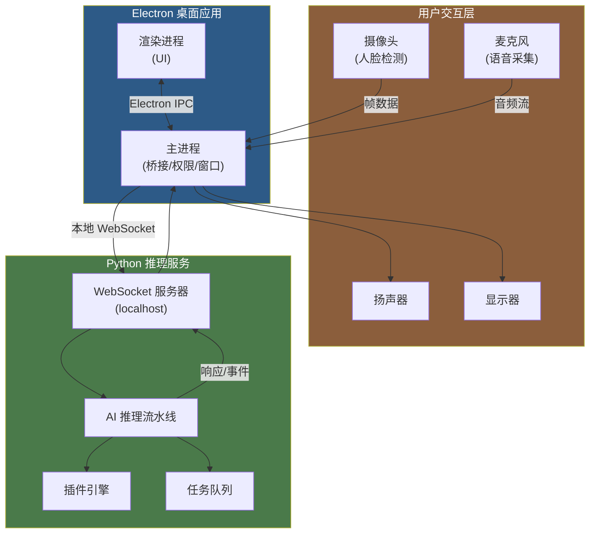

### 1.2 核心职责划分

| 层 | 组件 | 核心职责 |
|---|---|---|
| **Electron 主进程** | Node.js 运行时 | 窗口管理、系统托盘、摄像头/麦克风权限管理、IPC 桥接、音频输出路由 |
| **Python 推理服务** | Python 3.11+ | 人脸检测/识别、声纹识别、VAD、唤醒词、STT、身份融合、任务队列、插件执行 |
| **Electron 渲染进程** | HTML/CSS/JS (Vue 3) | 聊天 UI、家庭成员面板、任务看板、设置页、语音波形动画 |

---

## 2. 进程架构

### 2.1 进程拓扑

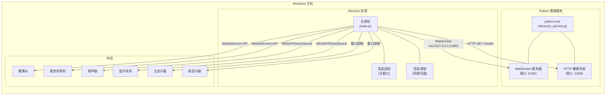

### 2.2 进程生命周期

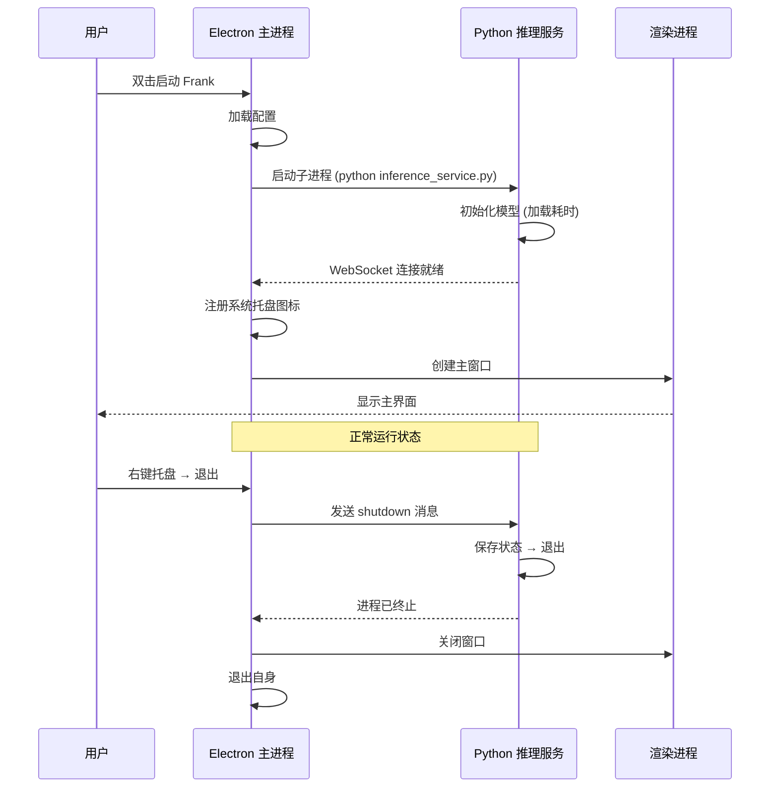

### 2.3 进程间通信 (IPC)

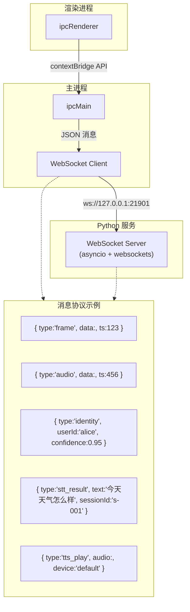

**IPC 通道定义：**

| 通道名 | 方向 | 说明 |
|---|---|---|
| `camera:frame` | Main → Python | 摄像头帧，用于人脸检测 |
| `audio:chunk` | Main → Python | 音频 PCM 块，用于 VAD/唤醒词/STT |
| `identity:update` | Python → Main | 身份识别结果 |
| `stt:result` | Python → Main | 语音转文本结果 |
| `llm:response` | Python → Main | LLM 响应文本 |
| `tts:play` | Python → Main | TTS 音频播放指令 |
| `state:change` | Python → Main | 状态机状态变更通知 |
| `device:enumerate` | Main → Python | 音频输出设备列表 |
| `plugin:execute` | Main / Python | 插件执行请求/响应 |

---

## 3. 状态机设计

### 3.1 状态定义与转换

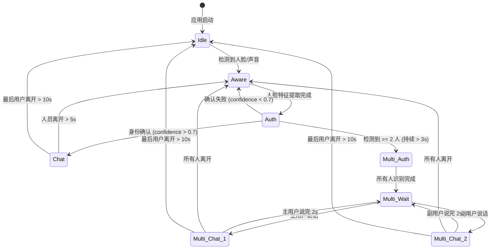

### 3.2 状态详细说明

| 状态 | 触发条件 | 行为 | 超时 |
|---|---|---|---|
| **Idle** (空闲) | 无人检测 | 摄像头低帧率采样 (5fps)，麦克风保持监听，显示器可息屏 | -- |
| **Aware** (感知) | 检测到人脸/声音 | 切换到高帧率 (30fps)，开始人脸特征提取，同时采集声纹 | 10s 未识别则回退 |
| **Auth** (认证) | 特征提取完成 | 比对人脸库 + 声纹库，融合评分，输出身份决策 | 5s 超时回退 |
| **Chat** (单人对话) | 身份确认 | 唤醒词监听 → STT → LLM → TTS 交互闭环 | 5min 无交互 → Aware |
| **Multi-Auth** (多人认证) | ≥2 人持续 3s | 分别提取每个人脸特征，并行识别 | 10s 超时回退 |
| **Multi-Wait** (多人等待) | 全部身份就绪 | 同时监听多个方向，按 VAD 决定响应对象 | -- |
| **Multi-Chat** (多人对话) | 某人说话 | 跟踪说话人身份，分别管理会话上下文 | -- |

### 3.3 状态机代码结构 (Python)

```python
# state_machine.py — 伪代码示意

from enum import Enum
import asyncio

class FrankState(Enum):
    IDLE = "idle"
    AWARE = "aware"
    AUTH = "auth"
    CHAT = "chat"
    MULTI_AUTH = "multi_auth"
    MULTI_WAIT = "multi_wait"
    MULTI_CHAT = "multi_chat"

class FrankStateMachine:
    def __init__(self):
        self.state = FrankState.IDLE
        self.person_count = 0
        self.identified_users: dict[str, float] = {}  # userId → confidence
        self.multi_person_timer: float = 0.0
        self._listeners = []

    async def transition(self, event: str, payload: dict = None):
        """事件驱动状态转换"""
        prev = self.state
        match (self.state, event):
            case (FrankState.IDLE, "person_detected"):
                self.state = FrankState.AWARE
            case (FrankState.AWARE, "features_extracted"):
                self.state = FrankState.AUTH
            case (FrankState.AUTH, "identity_confirmed"):
                self.state = FrankState.CHAT
            case (FrankState.CHAT, "multi_person_stable"):
                self.state = FrankState.MULTI_AUTH
            case _:
                return  # 无效转换

        await self._notify(prev, self.state, payload)
```

### 3.4 多人检测防抖机制

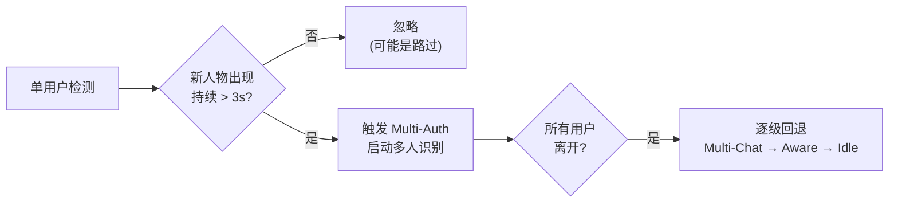

多人检测的 3 秒延迟是关键设计决策：避免因家庭成员短暂路过摄像头视野而错误触发多人模式。只有当新面孔在画面中稳定存在超过 3 秒，才判定为多人场景。

---

## 4. 数据流

### 4.1 主数据流 (单人模式)

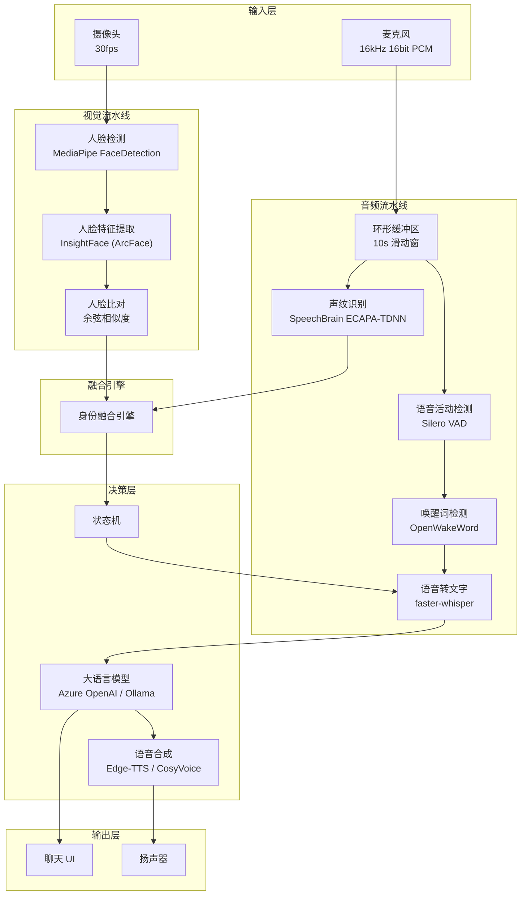

### 4.2 身份融合决策逻辑

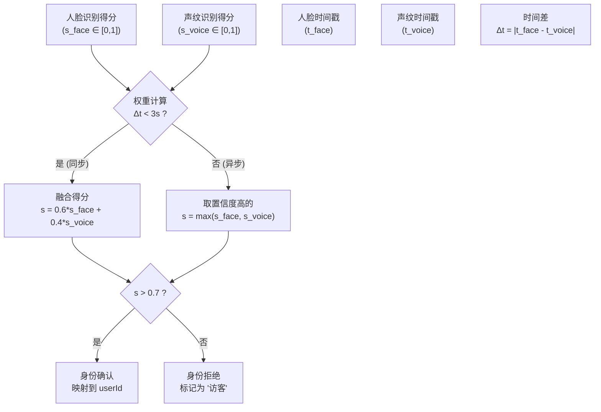

### 4.3 多模态时间同步

视觉和音频两条流水线的帧/块均携带采集时间戳（`time.time_ns()` 精度），在融合引擎中以时间窗口（3 秒）为基准进行对齐。若人脸和声纹的时间差在窗口内，则视为同步采集，启用融合评分；否则视为异步采集，取两者中置信度更高的结果。

---

## 5. 环形缓冲区设计

### 5.1 设计原理

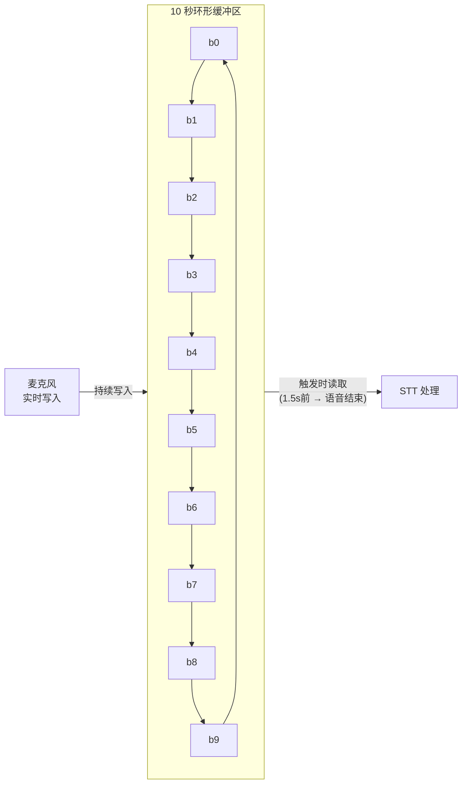

### 5.2 详细参数

| 参数 | 值 | 说明 |
|---|---|---|
| 总长度 | 10 秒 | 足够覆盖唤醒词前后的语音 |
| 采样率 | 16 kHz | Whisper 标准输入 |
| 位深 | 16-bit PCM | 标准音频格式 |
| 块大小 | 320 样本 (20ms) | VAD 最小分析单位 |
| 触发前读取 | 1.5 秒 | 唤醒词之前的语音上下文 |
| 触发后停止 | VAD 检测到静默 ≥0.5s | 自动截断语音尾端 |
| 存储格式 | `collections.deque(maxlen=N)` | Python 高效环形结构 |

### 5.3 触发读取流程

```python
# 环形缓冲区伪代码

class RingBuffer:
    def __init__(self, sample_rate=16000, duration_sec=10):
        self.buffer = deque(maxlen=sample_rate * duration_sec)
        self.sample_rate = sample_rate

    def feed(self, chunk: np.ndarray):
        """持续写入音频块"""
        self.buffer.extend(chunk)

    def extract_trigger(self, trigger_pos: int, silence_duration=0.5):
        """
        触发时提取音频段:
        - trigger_pos: 触发事件在 buffer 中的位置
        - 提取 trigger_pos - 1.5s 到 trigger_pos + 语音结束
        """
        pre_samples = int(1.5 * self.sample_rate)
        start = max(0, trigger_pos - pre_samples)
        audio = list(self.buffer)[start:]

        # VAD 检测语音结束点
        end = self._find_silence_end(audio, silence_duration)
        return np.array(audio[:end], dtype=np.int16)
```

### 5.4 多触发器协同

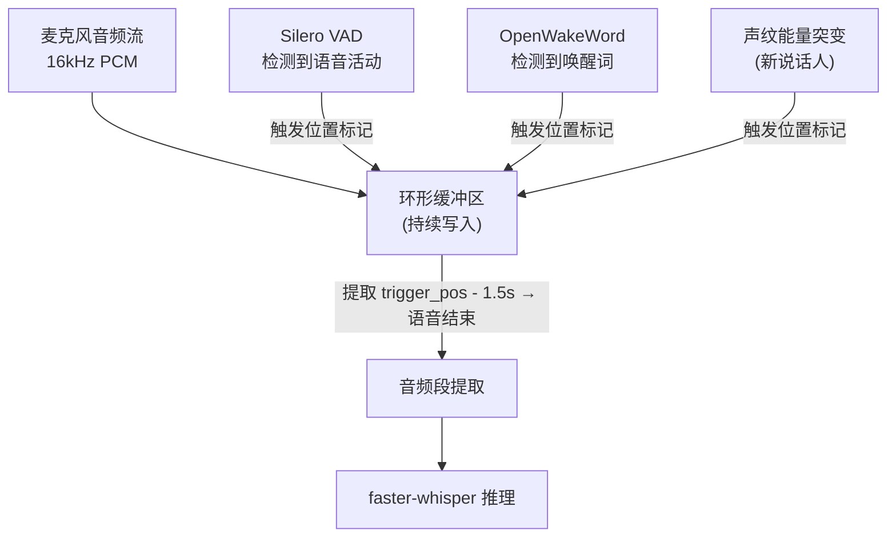

三种触发器均可独立或协同触发读取。VAD 标记语音开始位置，唤醒词提供精确的触发锚点，声纹能量突变用于多人会话中的说话人切换检测。

---

## 6. 多输出路由

### 6.1 路由拓扑

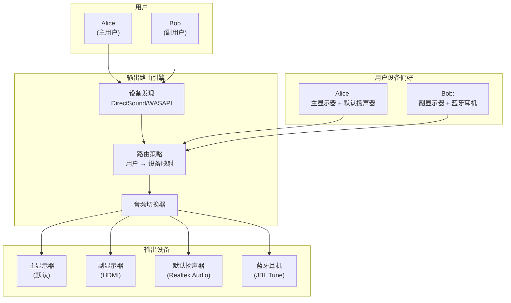

### 6.2 设备发现机制

```typescript
// 主进程中通过 WASAPI/DirectSound 枚举设备

interface AudioDeviceInfo {
    id: string;            // 设备唯一标识
    name: string;          // 设备友好名称
    type: 'speaker' | 'headphones' | 'earphone' | 'display';
    channels: number;      // 声道数 (2, 5.1, 7.1)
    isDefault: boolean;    // 是否为系统默认
    latency: number;       // 延迟 (ms)
}

// 枚举示例输出
const devices: AudioDeviceInfo[] = [
    { id: 'wasapi:0', name: '扬声器 (Realtek Audio)', type: 'speaker', channels: 2, isDefault: true, latency: 30 },
    { id: 'wasapi:1', name: 'JBL Tune 510BT', type: 'earphone', channels: 2, isDefault: false, latency: 80 },
    { id: 'directsound:0', name: 'DELL S2722QC (HDMI)', type: 'display', channels: 2, isDefault: false, latency: 50 },
];
```

### 6.3 路由策略

| 场景 | 主用户输出 | 副用户输出 | 说明 |
|---|---|---|---|
| 单人聊天 | 默认扬声器 + 主显示器 | — | 标准单用户模式 |
| 多人并行 | 默认扬声器 + 主显示器 | 蓝牙耳机 + 副显示器 | 互不干扰 |
| 多人同问 | 默认扬声器 + 主显示器 | 默认扬声器 + 主显示器 | 同一主题，合并回答 |
| 副用户无设备 | 默认扬声器 + 主显示器 | — | 降级为同一输出 |

---

## 7. 组件详细设计

### 7.1 Electron 主进程组件

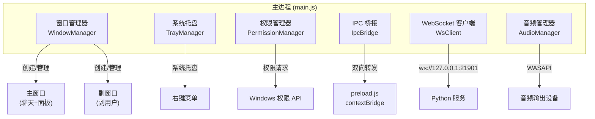

### 7.2 Python 推理服务组件

```mermaid
flowchart TD
    subgraph PythonService["Python 推理服务"]
        WS_SVR["WebSocket 服务器\n(websockets)"]
        ROUTER["消息路由器"]

        subgraph Pipeline["推理流水线"]
            FD["FaceDetector\n(MediaPipe)"]
            FE["FaceEncoder\n(InsightFace)"]
            VD["VoiceprintDetector\n(SpeechBrain)"]
            VAD["VoiceActivityDetector\n(Silero)"]
            WKD["WakeWordDetector\n(OpenWakeWord)"]
            STT["SpeechToText\n(faster-whisper)"]
        end

        subgraph Logic["业务逻辑"]
            FUSION["IdentityFusionEngine"]
            SM["StateMachine"]
            TASKQ["TaskQueue"]
            PLUGIN["PluginEngine"]
        end

        subgraph External["外部依赖"]
            AZURE_OPENAI["Azure OpenAI"]
            OLLAMA["Ollama (本地)"]
            TTS_SVC["Edge-TTS\n/CosyVoice"]
            FACE_DB["人脸特征库\n(SQLite + NumPy)"]
            VOICE_DB["声纹特征库\n(SQLite + NumPy)"]
        end

        WS_SVR --> ROUTER
        ROUTER --> Pipeline
        Pipeline --> Logic
        Logic --> External
    end
```

### 7.3 插件引擎设计

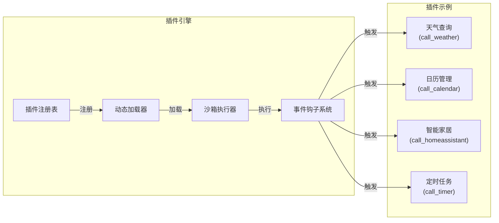

插件采用 Python 动态导入机制，每个插件是一个独立的 Python 包，通过 `entry_points` 注册。插件在沙箱环境中执行（受限的 `exec` + 资源限制），通过事件钩子（`on_voice_command`, `on_scheduled_task`）与主流程交互。

### 7.4 LLM 路由策略

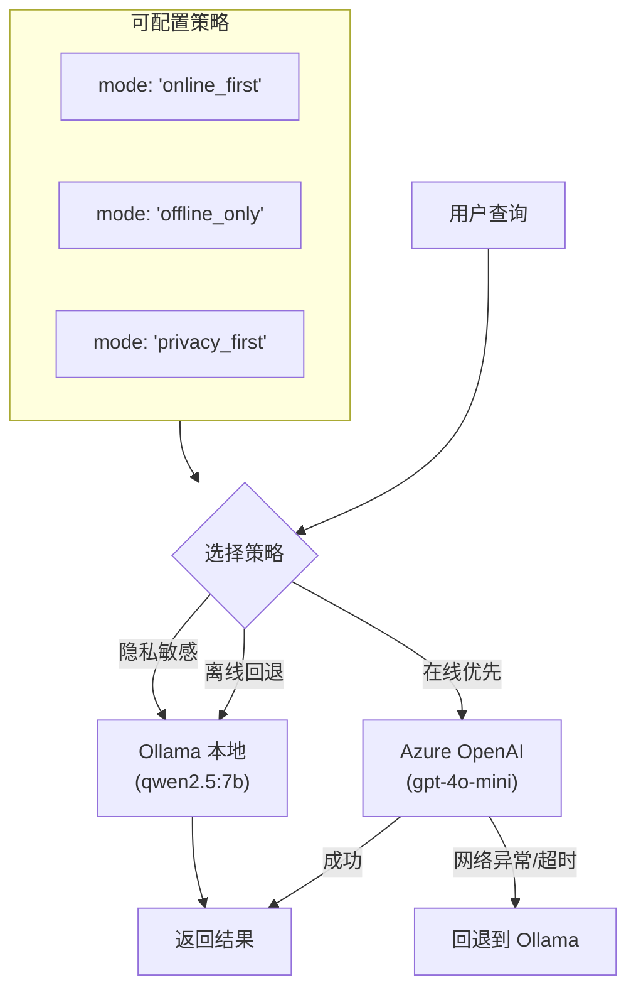

LLM 路由支持三种模式：
- **online_first**（默认）：优先使用 Azure OpenAI，失败时回退到 Ollama
- **offline_only**：仅使用本地 Ollama，适用于无网络环境
- **privacy_first**：涉及隐私关键词的查询强制走本地 Ollama

---

## 8. 部署与配置

### 8.1 目录结构

```
Frank/
├── package.json                  # Electron 项目配置
├── electron/
│   ├── main.js                   # 主进程入口
│   ├── preload.js                # contextBridge 预加载
│   ├── window-manager.js         # 窗口管理器
│   ├── tray-manager.js           # 系统托盘
│   ├── permission-manager.js     # 权限管理
│   ├── ws-client.js              # WebSocket 客户端
│   └── audio-manager.js          # 音频输出路由
├── renderer/
│   ├── src/
│   │   ├── App.vue               # 根组件
│   │   ├── components/
│   │   │   ├── ChatPanel.vue     # 聊天面板
│   │   │   ├── MemberPanel.vue   # 家庭成员面板
│   │   │   ├── TaskDashboard.vue # 任务看板
│   │   │   ├── SettingsPage.vue  # 设置页
│   │   │   └── WaveformAnim.vue  # 语音波形动画
│   │   └── stores/
│   │       ├── chat.ts           # 聊天状态
│   │       └── identity.ts       # 身份状态
│   └── index.html
├── inference-service/
│   ├── requirements.txt          # Python 依赖
│   ├── main.py                   # 服务入口
│   ├── state_machine.py          # 状态机
│   ├── ring_buffer.py            # 环形缓冲区
│   ├── identity_fusion.py        # 身份融合引擎
│   ├── pipeline/
│   │   ├── face_detector.py      # MediaPipe 人脸检测
│   │   ├── face_encoder.py       # InsightFace 编码
│   │   ├── voiceprint.py         # SpeechBrain 声纹
│   │   ├── vad.py                # Silero VAD
│   │   ├── wake_word.py          # OpenWakeWord
│   │   └── stt.py                # faster-whisper
│   ├── plugins/
│   │   ├── __init__.py
│   │   ├── weather.py            # 天气插件
│   │   └── calendar.py           # 日历插件
│   └── models/                   # 模型文件 (git LFS)
│       ├── insightface/
│       ├── silero-vad/
│       ├── openwakeword/
│       ├── whisper-tiny/
│       └── ecapa-tdnn/
└── docs/
    └── superpowers/
        └── specs/
            └── 2026-05-30-frank-01-system-architecture.md  # 本文档
```

### 8.2 启动顺序

```mermaid
sequenceDiagram
    participant FS as 文件系统
    participant EM as Electron 主进程
    participant PS as Python 服务
    participant R as 渲染进程

    Note over EM: 1. 读取配置文件
    EM->>FS: 读取 settings.json
    FS-->>EM: 返回配置

    Note over EM: 2. 启动 Python 推理服务
    EM->>PS: spawn('python', ['inference-service/main.py'])
    PS->>PS: 加载模型 (2-5s)
    PS->>PS: 启动 WebSocket (:21901)
    PS->>PS: 启动 HTTP (:21900)
    PS-->>EM: HTTP 200 /health

    Note over EM: 3. 建立 WebSocket 连接
    EM->>PS: ws://127.0.0.1:21901
    PS-->>EM: 连接成功

    Note over EM: 4. 初始化权限
    EM->>EM: 请求摄像头权限
    EM->>EM: 请求麦克风权限

    Note over EM: 5. 启动 UI
    EM->>R: BrowserWindow 创建
    R->>R: 挂载 Vue 应用
    R-->>EM: ipc:ready

    Note over EM,PS,R: 系统就绪
    EM-->>PS: { type:'start_pipeline' }
    PS->>PS: 开始采集帧/音频
```

---

## 9. 安全与隐私

### 9.1 数据本地化

- 所有人脸特征向量和声纹特征向量存储在本地 SQLite 数据库中，**不经过网络传输**
- 摄像头原始帧仅在本地处理，提取特征后立即丢弃
- 音频原始数据仅在触发事件后保留 10 秒，处理后丢弃
- LLM 查询可选择本地 Ollama 模式，完全不依赖云端

### 9.2 权限模型

| 权限 | 时机 | 用户控制 |
|---|---|---|
| 摄像头 | 首次启动 | Windows 权限弹窗 + 应用内开关 |
| 麦克风 | 首次启动 | Windows 权限弹窗 + 应用内开关 |
| 通知 | 首次交互 | 应用内开关 |
| 后台运行 | 安装时 | 系统托盘开关 |

### 9.3 身份数据安全

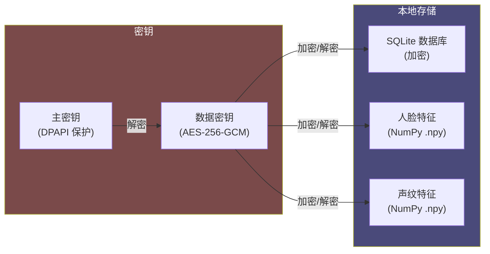

---

## 10. 附录

### 10.1 技术栈汇总

| 层 | 技术 | 版本 | 用途 |
|---|---|---|---|
| **桌面框架** | Electron | 32+ | 跨平台桌面应用 |
| **前端框架** | Vue 3 + Vite | 5+ | 渲染进程 UI |
| **AI 推理** | Python 3.11+ | 3.11 | AI 推理服务 |
| **人脸检测** | MediaPipe | 0.10+ | 人脸检测与关键点 |
| **人脸识别** | InsightFace (ArcFace) | 0.7+ | 人脸特征提取与比对 |
| **语音活动检测** | Silero VAD | 4.0+ | VAD |
| **唤醒词** | OpenWakeWord | 0.4+ | 唤醒词检测 |
| **语音识别** | faster-whisper | 1.0+ | STT |
| **声纹识别** | SpeechBrain ECAPA-TDNN | 1.0+ | 说话人确认 |
| **WebSocket** | websockets (Python) / ws (Node) | — | IPC 通信 |
| **LLM 云端** | Azure OpenAI (gpt-4o-mini) | — | 对话生成 |
| **LLM 本地** | Ollama (Qwen2.5) | — | 本地对话生成 |
| **TTS** | Edge-TTS / CosyVoice | — | 语音合成 |
| **音频路由** | WASAPI / DirectSound | — | Windows 音频设备 |
| **包管理** | npm + pnpm / pip + uv | — | 依赖管理 |

### 10.2 性能指标 (目标)

| 指标 | 目标值 | 测量方式 |
|---|---|---|
| 人脸检测延迟 | < 50ms (单帧) | Python 端计时 |
| 人脸识别延迟 | < 200ms (含特征提取) | Python 端计时 |
| VAD 延迟 | < 50ms | 音频块处理时间 |
| 唤醒词检测延迟 | < 300ms (从说完到检测) | 端到端计时 |
| STT 延迟 | < 500ms (3 秒音频) | faster-whisper 推理时间 |
| 身份融合耗时 | < 50ms | Python 端计时 |
| WebSocket 往返延迟 | < 5ms (本地) | ping/pong |
| 端到端响应 (STT → LLM → TTS) | < 3s | 用户感知延迟 |
| 多人切换延迟 | < 500ms | 状态机转换时间 |
| 内存占用 (Python) | < 2GB | 含所有模型 |
| 内存占用 (Electron) | < 500MB | 含渲染进程 |

### 10.3 Mermaid 图索引

| 图号 | 名称 | 位置 |
|---|---|---|
| 图 1 | 总体架构图 | 1.1 |
| 图 2 | 进程拓扑 | 2.1 |
| 图 3 | 进程生命周期 | 2.2 |
| 图 4 | IPC 通信 | 2.3 |
| 图 5 | 状态机 | 3.1 |
| 图 6 | 多人检测防抖 | 3.4 |
| 图 7 | 主数据流 | 4.1 |
| 图 8 | 身份融合决策 | 4.2 |
| 图 9 | 环形缓冲区 | 5.1 |
| 图 10 | 多触发器协同 | 5.4 |
| 图 11 | 输出路由拓扑 | 6.1 |
| 图 12 | 主进程组件 | 7.1 |
| 图 13 | Python 服务组件 | 7.2 |
| 图 14 | 插件引擎 | 7.3 |
| 图 15 | LLM 路由策略 | 7.4 |
| 图 16 | 启动顺序 | 8.2 |
| 图 17 | 身份数据加密 | 9.3 |

---

> **文档修订记录**
>
> | 版本 | 日期 | 修改内容 | 作者 |
> |---|---|---|---|
> | v1.0 | 2026-05-30 | 初稿创建 | Rowen |
