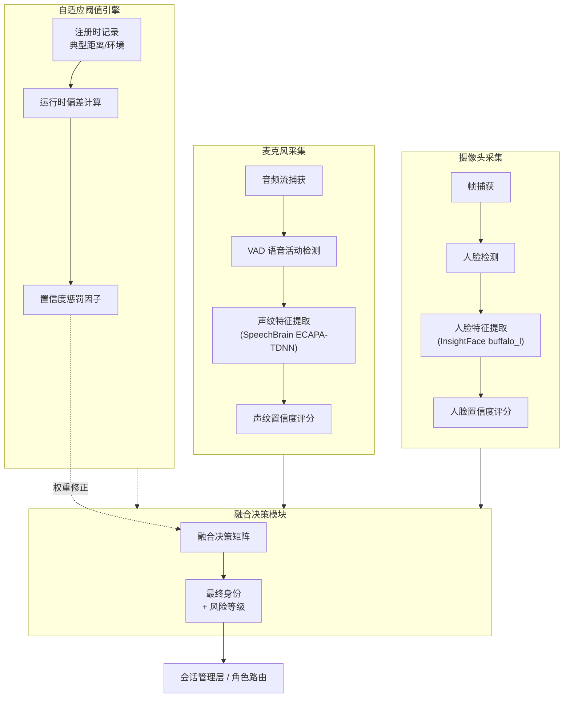
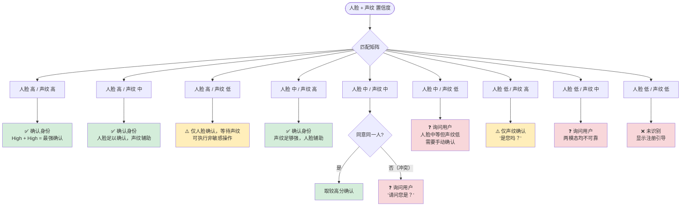
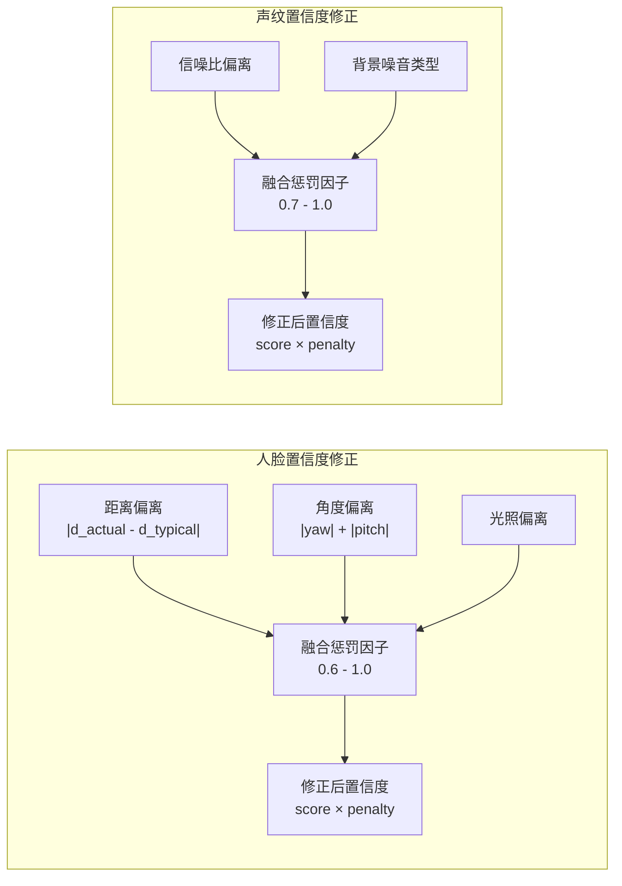
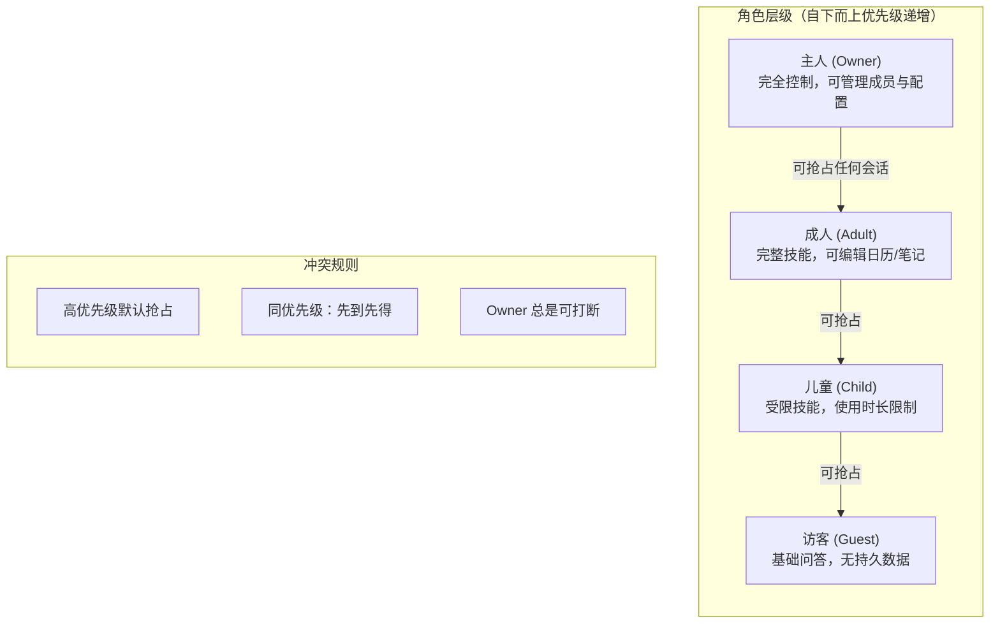
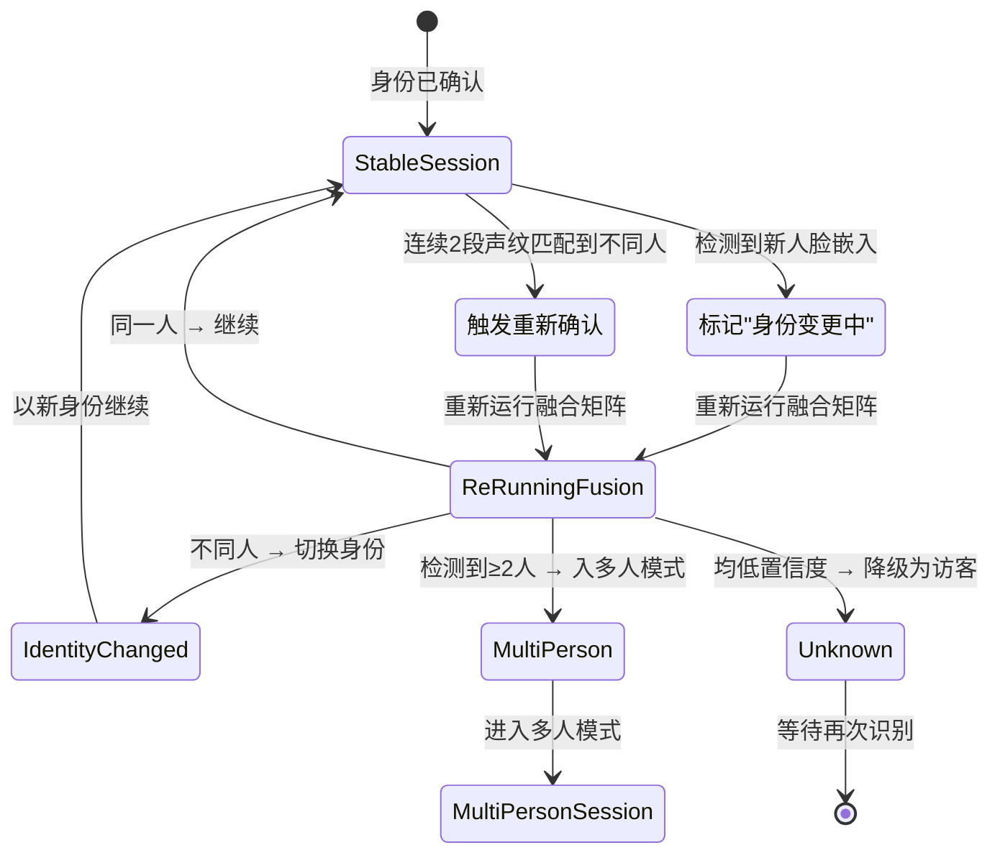
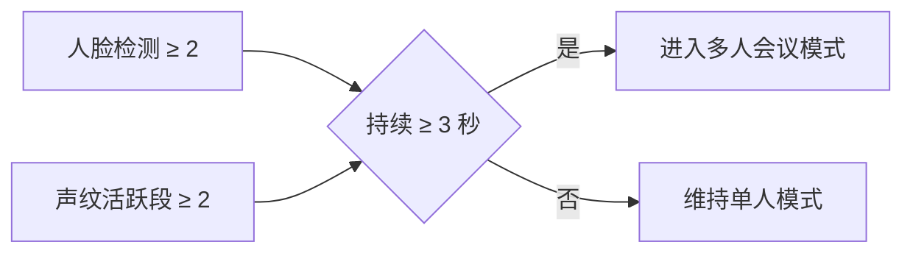
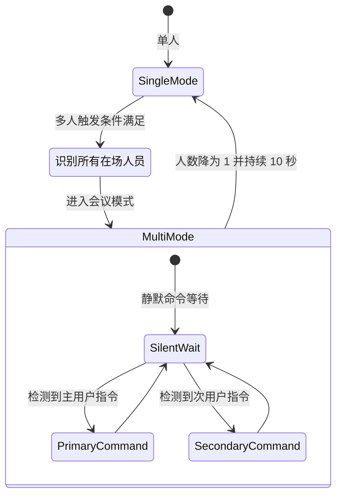
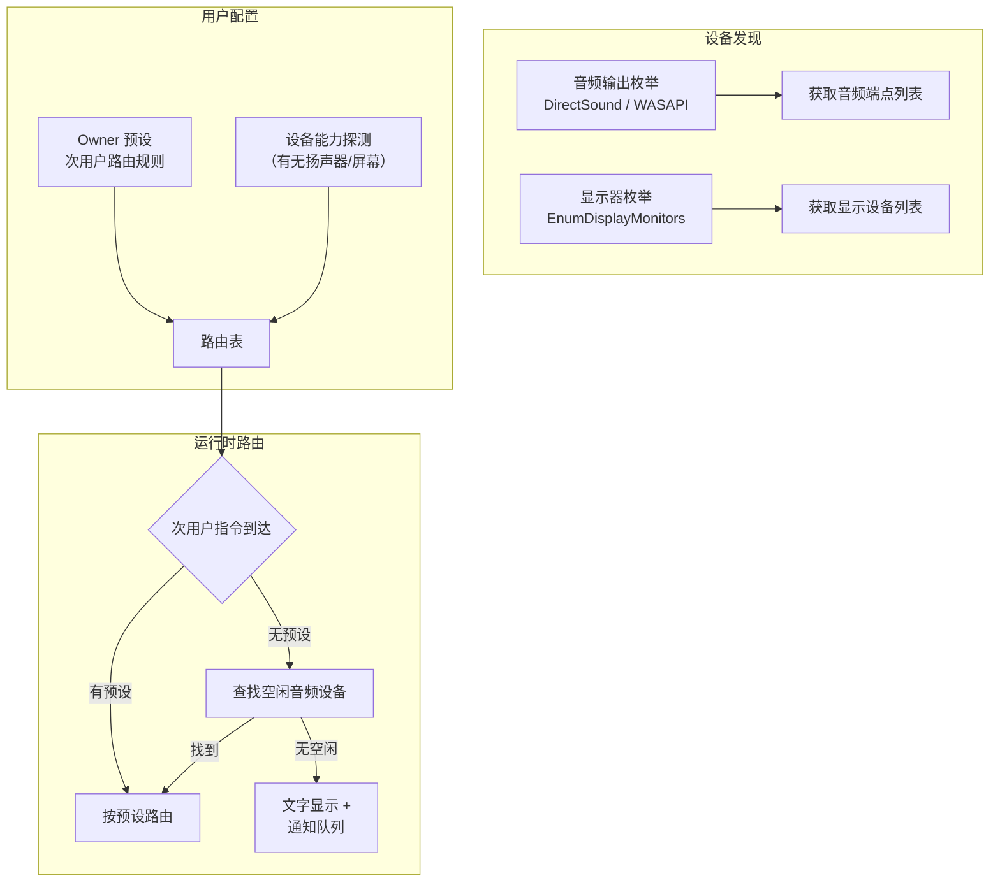
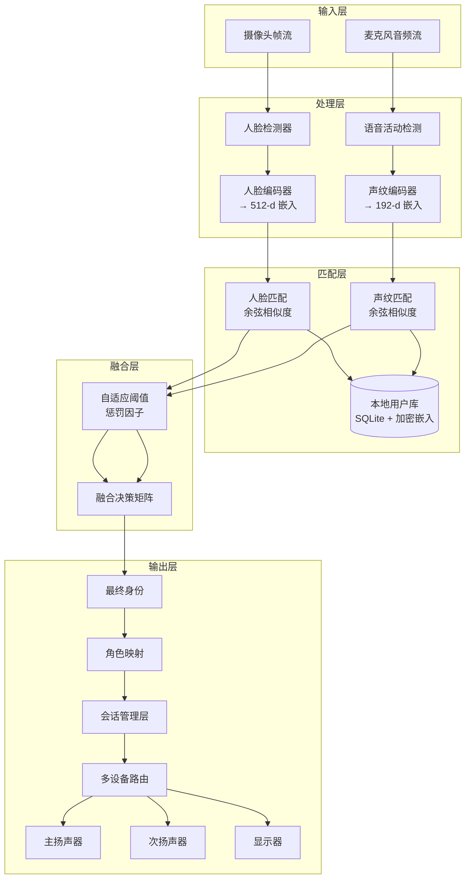

# Frank 身份识别与融合系统设计

| 元数据 | |
|---|---|
| 文档编号 | FRANK-SPEC-002 |
| 状态 | 草稿 |
| 作者 | Rowen |
| 创建日期 | 2026-05-30 |
| 更新日期 | — |
| 目标版本 | v0.2 |

---

## 1. 概述

Frank 通过**本地**人脸识别（摄像头）与声纹识别（麦克风）的双模态融合来确定家庭成员身份。所有生物特征处理均在本地完成，**不上传任何云端**。本文档描述双模态并行融合架构、决策矩阵、自适应阈值、角色层级、会话中身份变更检测、多人检测与会话模式、以及多输出设备路由。

---

## 2. 系统架构



**核心原则**：人脸与声纹**独立并行**运行，各自产出置信度分数。融合模块将二者结合，输出最终身份决策。任一模态可独立退化（光照差 → 声纹主导；噪音大 → 人脸主导），系统无需等待慢模态完成即可给出部分结论。

---

## 3. 融合决策矩阵

### 3.1 置信度等级定义

| 等级 | 人脸阈值范围 | 声纹阈值范围 |
|---|---|---|
| **高 (High)** | > 0.85 | > 0.80 |
| **中 (Medium)** | 0.50 – 0.85 | 0.50 – 0.80 |
| **低 (Low)** | < 0.50 | < 0.50 |

> 人脸高阈值高于声纹，因为人脸受光照/角度影响更大，需要更高置信度才能认为是可靠匹配。

### 3.2 矩阵网格



### 3.3 矩阵速查表

| 人脸 ╲ 声纹 | 低 (< 0.5) | 中 (0.5–0.80) | 高 (> 0.80) |
|---|---|---|---|
| **低 (< 0.5)** | ❌ 未识别，显示注册引导 | ❓ 询问用户 | ⚠️ 仅声纹，"是您吗？" |
| **中 (0.5–0.85)** | ❓ 询问用户 | 视一致性决定 | ✅ 确认身份 |
| **高 (> 0.85)** | ⚠️ 仅人脸，等待声纹 | ✅ 确认身份 | ✅ 确认身份 |

### 3.4 行为说明

- ✅ **确认身份** → 直接进入对应角色的会话上下文，无需额外交互。
- ⚠️ **仅 X 模态确认** → 允许执行非敏感操作（如"今天天气如何"），但拒绝涉及隐私/配置的操作，直到另一模态也确认。
- ❓ **询问用户** → Frank 主动发问："请问您是 X 吗？" 若用户口头确认（二次声纹匹配通过）或手动确认（触摸/按键），则升级为确认身份。失败则降级为访客。
- ❌ **未识别** → 显示注册引导界面，提供"我是新用户"入口。

---

## 4. 自适应置信度阈值

### 4.1 注册阶段记录

每个用户注册时，Frank 记录以下**基线数据**：

```yaml
典型特征:
  face:
    typical_distance_m: 1.2        # 注册时用户与摄像头的典型距离(米)
    typical_illuminance_lux: 350   # 注册时环境光照度
    enrollment_quality: 0.92       # 注册人脸质量分
    face_angle_pitch_deg: 0        # 正面俯仰角
    face_angle_yaw_deg: 0          # 正面偏转角
  voice:
    typical_snr_db: 25             # 注册时信噪比
    typical_background: "quiet"    # 注册时环境噪音分类
    enrollment_duration_ms: 3000   # 注册语音时长
    voice_embedding_dims: 192      # 声纹嵌入维度
```

### 4.2 运行时惩罚因子



**示例计算公式（人脸）**：

```
distance_penalty = clamp(1 - 0.15 * |d_actual - d_typical|, 0.6, 1.0)
angle_penalty   = clamp(cos(yaw) * cos(pitch), 0.7, 1.0)
illum_penalty   = clamp(min(lux_actual / lux_typical, 2.0), 0.8, 1.0)

face_penalty    = distance_penalty × angle_penalty × illum_penalty
adjusted_score  = raw_face_score × face_penalty
```

> **说明**：惩罚因子设计为乘法组合，范围均在 0.6–1.0 之间。单个模态最差情况下将原始分打六折，但不会完全否定。最终修正后的置信度传入第 3 节的融合决策矩阵。

### 4.3 持续学习

Frank 每隔 N 次成功识别后，用近期成功识别的平均环境参数**滑动更新**用户的典型基线。新基线取指数加权移动平均（EWMA）：

```
baseline_new = α × recent_avg + (1 - α) × baseline_old
```

其中 α = 0.3，避免单次异常值大幅偏移基线。

---

## 5. 角色层级



### 5.1 角色能力矩阵

| 能力 | Owner | Adult | Child | Guest |
|---|---|---|---|---|
| 基础问答 | ✅ | ✅ | ✅（受限） | ✅（仅通用） |
| 个人信息访问 | ✅ 全部 | ✅ 本人 | ✅ 本人（受限） | ❌ |
| 日历/笔记编辑 | ✅ 全部 | ✅ 共享 | ❌ | ❌ |
| 成员管理 | ✅ | ❌ | ❌ | ❌ |
| 系统配置 | ✅ | ❌ | ❌ | ❌ |
| 打断更高层用户 | ✅ 总是 | ❌ | ❌ | ❌ |
| 使用时长限制 | 无 | 无 | 有（家长控制） | 无（单次会话） |
| 敏感技能授权 | ✅ 默认 | ✅ 需确认 | ❌ | ❌ |

### 5.2 抢占规则

1. **高优先级抢占低优先级** — 当 Frank 检测到更高层级用户的声音或人脸时，自动暂停当前会话，提示"X 来了，我先处理他/她的请求"。
2. **同优先级先到先得** — 连续请求按时间排队，不抢占。
3. **Owner 特权** — 主人总是可以打断，无需等待。打断时保存当前会话摘要，推送到主人的通知队列。

---

## 6. 会话中身份变更检测



### 6.1 人脸变更

- Frank 持续进行**人脸跟踪**，每帧比较当前人脸嵌入与已确认用户的嵌入。
- 当**新的嵌入与当前用户不匹配**且置信度 > 0.7 时，触发 `FaceChanging` 事件。
- 当前会话**暂挂**（pause），上下文保存到会话栈。
- 重新运行融合矩阵，确定新用户身份。

### 6.2 声纹变更

- 音频流经 VAD 切分为语音段，每段提取声纹嵌入。
- **连续 2 段**声纹均匹配到同一不同人员时（而非偶发误检），触发 `VoiceChanging` 事件。
- 这比人脸变更多一次确认，因为声纹对环境噪音更敏感，需要减少误触发。

### 6.3 融合再运行

无论触发源是哪一模态，`ReRunningFusion` 状态的逻辑相同：

1. 冻结当前会话上下文。
2. 获取最近的人脸帧和最近的声纹段（时间窗口 3 秒内）。
3. 重新执行融合决策矩阵（第 3 节）。
4. 根据结果路由到对应分支。

---

## 7. 多人检测与会话模式

### 7.1 触发条件



两个条件满足其一即可触发。3 秒持续时间避免短暂经过摄像头或咳嗽声造成的误触发。

### 7.2 多人会议模式



**会议模式下关键约束**：

1. **先识别**：进入会议模式前，Frank 先对所有检测到的人脸运行融合矩阵，标记在场人员的身份。
2. **不打断**：模式切换不中断正在进行的对话。如果 Frank 正在回复主用户，后续检测到多人不会切断当前输出。
3. **主用户输出**：主输出通道（默认扬声器）继续服务**主用户**（当前会话持有者）。
4. **次用户路由**：第二个用户的指令路由到**次要输出设备**（参见第 8 节）。若无次要设备，则在主屏幕上显示文字提示 + 队列通知。

### 7.3 声源定位提示

会议模式中，Frank 可利用麦克风阵列（如有）的声源定位信息辅助判断当前是谁在说话。若无阵列，则基于声纹快速匹配到已识别的人员集合。

---

## 8. 多输出设备路由

### 8.1 设备发现



### 8.2 路由优先级

| 优先级 | 方式 | 说明 |
|---|---|---|
| 1 (最高) | 用户预设 | Owner 在设置页面中为特定次用户绑定设备（如"儿童的回答走书房音箱"） |
| 2 | 空闲音频设备 | 扫描当前无播放流的音频端点，优先选择未被占用的 |
| 3 | 文字显示 + 队列通知 | 在显示器上弹窗显示次用户回答，并在主用户输出结束后语音提示"X 有一条未读回复" |

### 8.3 多输出示例场景

| 场景 | 主用户 | 次用户 | 路由行为 |
|---|---|---|---|
| 客厅主人看电视，孩子在旁边 | 主人 | 儿童 | 儿童的回答路由到书房音箱（预设） |
| 厨房两人，都未预设 | 用户 A | 用户 B | B 的回答路由到厨房备用的蓝牙音箱 |
| 只有一台音箱已占用 | 用户 A | 用户 B | B 的回复以文字在屏幕上显示，A 结束后播报"B 有一条回复" |

---

## 9. 异常场景处理

| 场景 | 行为 |
|---|---|
| **摄像头故障** | 降级为纯声纹识别，声纹置信度阈值提高到 0.90 以降低误识率 |
| **麦克风故障** | 降级为纯人脸识别，人脸置信度阈值提高到 0.92，要求用户靠近摄像头 |
| **两模态均故障** | 显示紧急 UI，进入离线访客模式，仅支持基础触摸/按键交互 |
| **突然断电/崩溃** | 会话上下文写入持久化队列，恢复后重建上一个稳定状态 |
| **用户中途离开** | 人脸丢失 + 声纹静默持续 60 秒 → 自动结束会话，清除敏感缓存 |
| **环境噪声突变** | 声纹置信度惩罚因子实时响应 SNR 变化，不触发硬切换，仅平滑降低权重 |

---

## 10. 数据流总图



---

## 11. 关键设计决策记录

| 决策编号 | 决策 | 备选方案 | 理由 |
|---|---|---|---|
| DEC-001 | 人脸和声纹完全并行，不做主从依赖 | 以人脸为主，声纹辅助 | 独立退化场景下任一模态可单独工作，提升鲁棒性 |
| DEC-002 | 阈值不做死，加自适应惩罚因子 | 固定阈值 + 人工调参 | 家庭环境千差万别，自适应降低误识率更有效 |
| DEC-003 | Owner 可无条件抢占 | 所有角色按队列轮流 | 家庭场景中主人的控制权是最核心的需求 |
| DEC-004 | 声纹变更需要连续 2 段确认 | 单段即触发 | 声纹对环境噪声敏感，2 段减少误触发 |
| DEC-005 | 多人模式持续 3 秒才触发 | 即时触发 | 避免短暂路过/咳嗽导致的模式乒乓切换 |
| DEC-006 | 次用户无可用设备时走文字+队列 | 直接忽略或排队等待 | 保证所有用户都能获得反馈，且不丢失请求 |
| DEC-007 | 嵌入存储于本地 SQLite，加密 | 明文存储 / 云端存储 | 满足本地隐私要求，加密防止冷数据泄露 |
| DEC-008 | 人脸/声纹阈值不对称（人脸 0.85，声纹 0.80） | 统一阈值 | 人脸受光照/角度影响更大，需要更高置信度才能确认 |

---

## 12. 附录

### 12.1 术语表

| 术语 | 英文 | 定义 |
|---|---|---|
| VAD | Voice Activity Detection | 语音活动检测，判断音频中是否有说话人 |
| 嵌入 / Embedding | Embedding | 神经网络提取的特征向量，用于相似度比较 |
| 余弦相似度 | Cosine Similarity | 度量两个嵌入向量夹角的 cos 值，范围 [-1, 1] |
| EWMA | Exponentially Weighted Moving Average | 指数加权移动平均，用于平滑更新基线参数 |
| WASAPI | Windows Audio Session API | Windows 音频会话接口，用于枚举 audio endpoints |
| 声源定位 | Sound Source Localization | 利用麦克风阵列判断声源方向 |

### 12.2 相关文档

- [Frank 整体产品规格](./2026-05-29-frank-01-product-charter.md) (计划)
- Frank 技能系统设计文档 (待编写)
- Frank 家长控制与儿童安全设计文档 (待编写)
