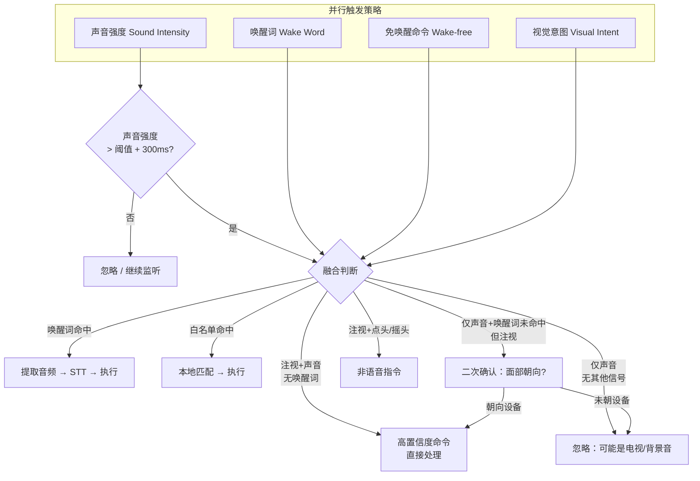
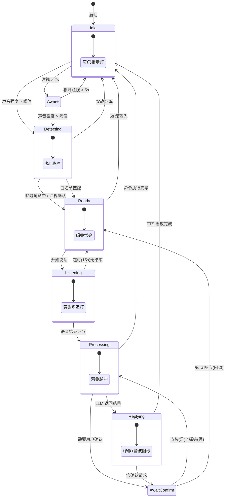
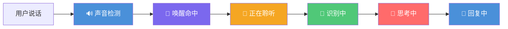
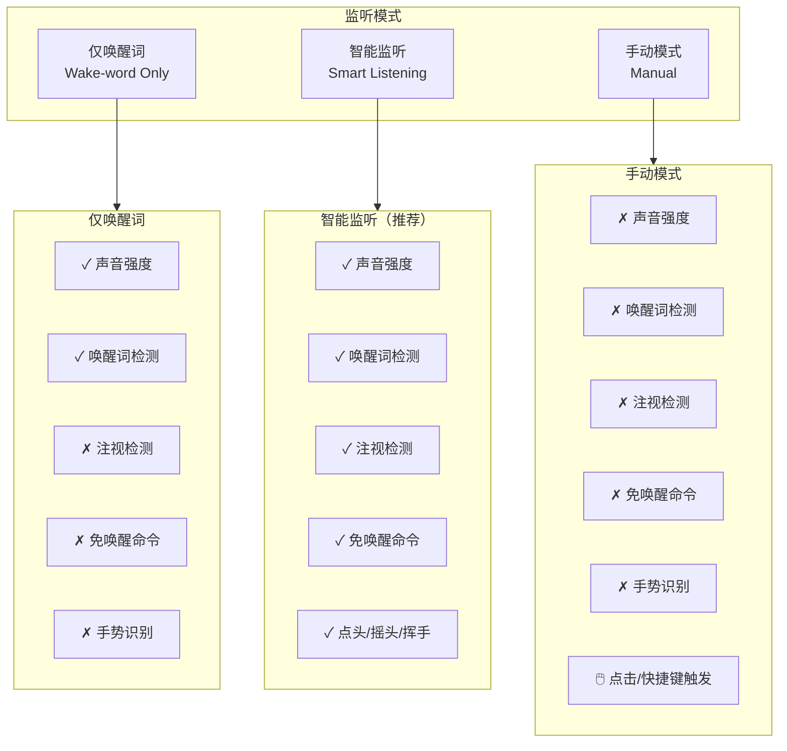
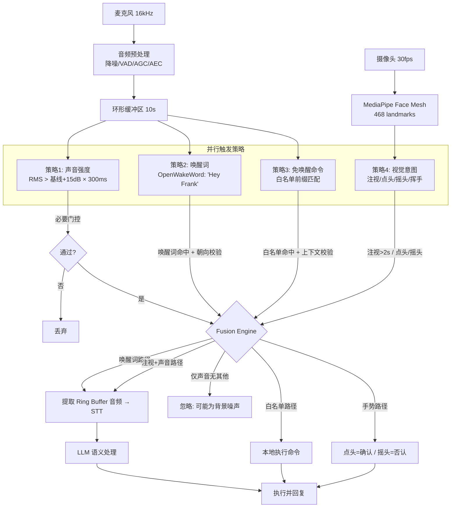
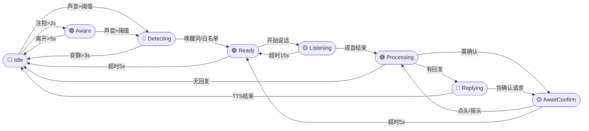

# Frank (弗兰克) 交互模型与 UI 设计文档

> **版本**: v0.3  
> **日期**: 2026-05-30  
> **状态**: 草案  
> **对应**: 桌面端实时语音助手 "Frank"

---

## 1. 概述

Frank 是一款桌面端实时语音监听助手（非按键通话），通过多种触发策略并行判断用户何时在与它对话。助手名称为 Frank（弗兰克），称呼男性用户为"先生"或"sir"，称呼女性用户为"女士"。

### 1.1 核心原则

- **始终监听**：麦克风持续捕获，不依赖手动触发。
- **多策略融合**：声音、视觉、关键词三种模态并行工作，单一模态不足以误触发。
- **隐私优先**：唤醒词检测和免唤醒命令均在本地完成，不会上传云端。
- **状态透明**：UI 实时呈现助手状态，让用户始终清楚当前处于"监听中""处理中"或"空闲"。

---

## 2. 实时语音监听架构

### 2.1 音频管道

```
麦克风 (16kHz, 16bit, mono)
        │
        ▼
  音频预处理
  ┌─────────────────────────────┐
  │ • 降噪 (RNNoise / Speex)    │
  │ • VAD (Silero VAD)           │
  │ • 自动增益控制               │
  │ • 回声消除 (AEC)             │
  └─────────────────────────────┘
        │
        ▼
  环形缓冲区 (Ring Buffer, 10秒)
  ┌──────────────────────────────────────────┐
  │ 始终保留最近 10 秒的原始 PCM 音频          │
  │ 策略命中时提取 [触发点前 1.5 秒, 触发点后直到静音] │
  │ 用于 STT 转录                           │
  └──────────────────────────────────────────┘
        │
        ▼
  并行触发策略（详见第3节）
  ┌──────────┬────────────┬───────────┐
  │ 声音强度  │  唤醒词    │ 免唤醒命令 │
  │ (Energy) │ (WakeWord) │ (Whitelist)│
  └──────────┴────────────┴───────────┘
```

**关键参数**：

| 参数 | 默认值 | 说明 |
|---|---|---|
| 采样率 | 16 kHz | 语音识别标准采样率 |
| 位深 | 16 bit | PCM 线性量化 |
| 环形缓冲区时长 | 10 秒 | 保证唤醒词前有足够上下文 |
| VAD 帧长 | 30 ms | WebRTC VAD 每帧分析 |
| 降噪强度 | 中 | RNNoise 内置模型 |

---

## 3. 触发策略

四种触发策略并行运行，通过融合逻辑决定是否进入命令处理流程。

### 3.1 策略一：声音强度检测（Sound Intensity）

作为**前置门控**——必要但不充分条件。

- 检测方式：计算短时能量（每 50ms 窗口 RMS）
- 阈值：环境噪音基线上方 15 dB，持续 300ms 以上
- 作用：排除静音/低噪状态，避免空闲时的不必要计算
- 局限性：纯音量不足以区分人声和杂音（电视声、键盘声等）

```
RMS(dB) ▲
        │         ╱╲
        │   ╱╲   ╱  ╲╱╲   ╱╲
        │  ╱  ╲ ╱      ╲ ╱  ╲
        │ ╱    ╲        ╲╱    ╲
  threshold ──────────────┴───────→ t(ms)
        │     ↑  >300ms  ↑
        │     ╰──────────╯
        │     触发强度事件
```

### 3.2 策略二：唤醒词检测（Wake Word）

使用本地模型（OpenWakeWord）检测预设唤醒词。

- **默认唤醒词**："Hey Frank"
- **可定制**：用户可录制自定义唤醒词
- **流程**：唤醒词命中 → 从环形缓冲区提取音频 → STT（Whisper.cpp 本地）→ 语义解析 → 执行命令
- **二次校验**：触发时检查人脸朝向（见策略四），确保是用户在对着设备说话

```
[唤醒词命中] ─→ [面部朝向校验]
                    │
               ┌────┴────┐
               │ 朝√向设备 │ 朝×向设备
               │          │
           [提取音频]   [忽略（可能是背景语音）]
               │
           [STT 转录]
               │
           [语义解析 & 执行]
```

### 3.3 策略三：免唤醒命令（Wake-free Commands）

高频命令白名单，无需唤醒词即可直接触发。

**示例白名单命令**：

| 类别 | 命令 | 生效条件 |
|---|---|---|
| 媒体控制 | 暂停 / 继续 / 下一首 / 上一首 | 媒体播放中 |
| 时钟询问 | 几点了 / 现在几点 | 始终生效 |
| 智能家居 | 开灯 / 关灯 / 打开空调 | 已连接智能家居设备 |
| 音量控制 | 大声点 / 小声点 / 安静 | TTS 播放中 |
| 确认应答 | 是的 / 对 / 没错 / 不用 | 助手处于 AwaitConfirm 状态 |

**规则**：

- 仅在本地进行关键词匹配和上下文校验，**永不发送给 LLM**
- 上下文校验失败（例如播放停止时说"下一首"）→ 静默忽略，不给反馈
- 白名单由 Owner 在设置界面管理，支持增删和启用/禁用
- 匹配方式：前缀匹配 + 编辑距离（Levenshtein ≤ 1），容忍轻度口音变体

### 3.4 策略四：视觉意图识别（Visual Intent Recognition）

使用摄像头和 MediaPipe Face Mesh（468 个面部关键点）实现非语音交互。

#### 3.4.1 注视检测（Gaze Detection）

- **方法**：眼球中心 + 虹膜位置 → 视线向量
- **阈值**：视线向量与摄像头法线夹角 ≤ ±10° = "正在看设备"
- **注视 >2 秒** → 进入 Aware 状态，UI 提示"已就绪"
- **注视判定流程**：

```
Face Mesh 输出 468 关键点
        │
   提取眼周关键点
   ┌─────────────────────────┐
   │ 左眼: 33~133            │
   │ 右眼: 362~263           │
   │ 虹膜中心: 468, 473      │
   └─────────────────────────┘
        │
   计算视线向量 (gaze vector)
        │
   与摄像头法线比较
   ┌─────────────────────────┐
   │ 夹角 ≤ ±10° → 正在注视  │
   │ 夹角 > ±10°  → 未注视   │
   └─────────────────────────┘
        │
   注视累计计时
   ┌─────────────────────────┐
   │ 注视持续 > 2s → Aware   │
   │ 注视中断     → 重置计时  │
   └─────────────────────────┘
```

#### 3.4.2 点头检测（Nod → 确认 "Yes"）

- **特征**：鼻尖（关键点 1）Y 轴周期性上下摆动
- **模式**：下降-上升-下降（点头波形），单次 200~600ms
- **触发精度**：减小误判阈值，要求在 1.5s 内完成至少 2 个完整周期
- **生效条件**：助手处于 AwaitConfirm 或 AwaitChoice 状态

```
鼻尖 Y 轴 ▲
          │   ╱╲      ╱╲
          │  ╱  ╲    ╱  ╲
          │ ╱    ╲  ╱    ╲
          │╱      ╲╱      ╲
          └───────────────────→ t
              点头-1    点头-2
               (确认 "yes")
```

#### 3.4.3 摇头检测（Head Shake → 拒绝 "No"）

- **特征**：鼻尖（关键点 1）X 轴周期性左右摆动
- **模式**：左-右-左（摇头波形），单次 200~600ms
- **触发精度**：1.5s 内 ≥ 2 个完整周期
- **生效条件**：助手处于 AwaitConfirm 状态

```
鼻尖 X 轴 ▲
          │╲    ╱╲    ╱
          │ ╲  ╱  ╲  ╱
          │  ╲╱    ╲╱
          └───────────────────→ t
             摇头-1   摇头-2
                (拒绝 "no")
```

#### 3.4.4 挥手检测（Hand Wave → 唤醒设备）

- **方法**：MediaPipe Hands (21 个关键点) 检测到手部 + 手掌平面运动
- **模式**：水平方向往返运动（左→右→左），1s 内完成
- **用途**：当用户距离设备较远、不想说唤醒词时，挥手触发

---

## 4. 触发融合逻辑

四种策略的输出通过融合逻辑模块综合判断。**声音强度是必要但不充分条件**。



### 4.1 融合判定规则表

| 声音强度 | 唤醒词 | 注视 | 白名单 | 结论 |
|---|---|---|---|---|
| ✓ | ✓ | - | - | **处理**：唤醒词命中，提取音频转写 |
| ✓ | - | ✓ | - | **处理**：高置信度，直接转写 |
| ✓ | - | - | ✓ | **处理**：免唤醒命令 |
| ✓ | - | - | - | **忽略**：纯噪音（电视/对话） |
| - | - | - | - | **忽略**：静音状态 |
| - | ✓ | - | - | 不可能出现（唤醒词需要声音） |
| - | ✓ | ✓ | - | 不可能出现（唤醒词需要声音） |
| ✓ | - | ✓ | ✓ | **处理**：多重信号增强 |

> **注**：声音强度是必要项，任何执行路径都必须通过声音门控。

---

## 5. 状态机

Frank 助手在四个主要状态间流转：



### 5.1 状态说明

| 状态 | 指示灯 | 说明 |
|---|---|---|
| Idle（空闲） | ⚪ 灰色 | 无活动，低功耗监听 |
| Detecting（检测中） | 🔵 蓝色脉冲 | 捕捉到声音，正在分析 |
| Aware（就绪） | 🟢 绿色 | 注视检测通过，准备接收指令 |
| Ready（准备） | 🟢 绿色常亮 | 已确认用户意图，准备转写 |
| Listening（聆听） | 🟡 黄色呼吸 | 正在接收语音输入 |
| Processing（处理中） | 🟣 紫色脉冲 | 正在调用 STT/LLM |
| Replying（回复中） | 🟢 绿色+音波 | TTS 播放中 |
| AwaitConfirm（等待确认） | 🟡 黄色闪烁 | 等待用户点头/摇头确认 |

---

## 6. 语音交互反馈链

每次完整的语音交互按以下步骤呈现，每个步骤在聊天区域上方显示短暂图标+文字提示。



### 6.1 反馈阶段对照

| 阶段 | 图标 | 文字 | 时长 | 说明 |
|---|---|---|---|---|
| 声音检测 | 🔊 | 检测到声音... | 300ms | VAD 激活即显示 |
| 唤醒命中 | 🎯 | 唤醒命中 | 1s | OpenWakeWord 识别成功 |
| 正在聆听 | 🎤 | 我在听... | 持续 | 录音状态指示 |
| 识别中 | 📝 | 正在识别... | STT 耗时 | Whisper 转录 |
| 思考中 | 💬 | 让我想想... | LLM 耗时 | 语义处理 |
| 回复中 | 🤖 | （自动隐藏） | TTS 时长 | 语音输出 |

免唤醒命令跳过"唤醒命中"步骤，直接从"声音检测"→"正在聆听"→本地匹配→执行。

---

## 7. UI 布局设计

### 7.1 界面模式

Frank 桌面应用支持两种窗口模式，平滑切换，记忆窗口大小与位置。

#### 紧凑模式（Compact Mode）360 × 500 px

```
┌──────────────────────────────────┐
│ [用户头像] 王先生        ● 🟢   │ ← 标题栏
├──────────────────────────────────┤
│                                  │
│  ┌────────────────────────────┐  │
│  │  👋 下午好，王先生          │  │ ← 欢迎卡片
│  │  有什么我可以帮你的？       │  │
│  └────────────────────────────┘  │
│                                  │
│  ┌────────────────────────────┐  │
│  │ 用户: 今天天气怎么样        │  │
│  │ Frank: 今天晴，25~30°C    │  │
│  │                            │  │ ← 聊天区域
│  │                            │  │
│  └────────────────────────────┘  │
│                                  │
│  ┌────────────────────────────┐  │
│  │ 📝 输入消息...          ➤  │  │ ← 输入区域
│  └────────────────────────────┘  │
│                                  │
│  [📋任务] [👥成员] [⚙️设置]    │ ← 底部工具栏
└──────────────────────────────────┘
```

#### 展开模式（Expanded Mode）800 × 600 px

```
┌───────────────────────────────────────────────────┐
│ [用户头像] 王先生                    ● 🟢        │ ← 标题栏
├───────────────────────┬───────────────────────────┤
│                       │                           │
│ ┌─────────────────┐   │  📋 任务列表              │
│ │ 👋 下午好        │   │  ┌─────────────────────┐ │
│ │ 有什么我可以     │   │  │ ☐ 买牛奶             │ │
│ │ 帮你的？         │   │  │ ☐ 发送周报           │ │ ← 侧边栏
│ └─────────────────┘   │  │ ☑ 预订酒店           │ │
│                       │  └─────────────────────┘ │
│ ┌─────────────────┐   │                           │
│ │ 用户: 今天天气   │   │  👥 在线成员              │
│ │ Frank: 晴~30°C  │   │  ┌─────────────────────┐ │
│ │                 │   │  │ 🟢 Alice             │ │
│ │                 │   │  │ 🟡 Bob (away)        │ │
│ └─────────────────┘   │  └─────────────────────┘ │
│                       │                           │
│ ┌─────────────────┐   │  ⚙️ 设置                  │
│ │ 📝 输入...   ➤  │   │  ┌─────────────────────┐ │
│ └─────────────────┘   │  │ 监听模式              │ │
│                       │  │ 唤醒词配置            │ │
│ [📋] [👥] [⚙️] [🔄]  │  │ 白名单管理            │ │
└───────────────────────┴───────────────────────────┘
```

### 7.2 布局组件树

```
Window
├── TitleBar
│   ├── UserAvatar
│   ├── UserNameLabel         ("王先生" / "Ms. Li")
│   ├── StatusIndicator       (● 颜色脉冲/常亮)
│   └── WindowControls        (切换模式 / 最小化 / 关闭)
│
├── WelcomeCard               (可选，首次对话或每日首次)
│   ├── GreetingText          ("下午好，王先生")
│   └── HintText              ("有什么我可以帮你的？")
│
├── ChatArea
│   ├── FeedbackChain         (🔊→🎯→🎤→📝→💬→🤖)
│   ├── MessageList
│   │   ├── UserMessage       (右对齐，用户头像)
│   │   ├── FrankMessage      (左对齐，Frank 头像)
│   │   └── TimestampDivider  ("今天 14:30")
│   └── ScrollToBottomButton
│
├── InputArea
│   ├── TextInput             (placeholder="输入消息，或直接说话...")
│   ├── MicButton             (显示当前状态颜色)
│   └── SendButton            (仅文本模式)
│
└── BottomToolbar
    ├── TasksButton           (📋 任务面板)
    ├── MembersButton         (👥 成员列表)
    ├── SettingsButton        (⚙️ 设置面板)
    └── SwitchUserButton      (🔄 切换用户)
```

### 7.3 状态指示器色板

| 颜色 | 动画 | Hex | 含义 |
|---|---|---|---|
| 🔵 蓝色 | 脉冲呼吸 | `#4A90D9` | Detecting（检测到声音，分析中） |
| 🟢 绿色 | 常亮 | `#50C878` | Ready / Aware（就绪） |
| 🟡 黄色 | 缓慢呼吸 | `#F5A623` | Listening / AwaitConfirm（聆听/等待确认） |
| ⚪ 灰色 | 常亮 | `#B0B0B0` | Idle（空闲） |
| 🟣 紫色 | 脉冲旋转 | `#9B59B6` | Processing（处理中） |
| 🔴 红色 | 常亮 | `#E74C3C` | Multi-person（多人同时说话，检测到多人声纹） |

### 7.4 窗口行为

| 行为 | 说明 |
|---|---|
| 默认启动模式 | 紧凑模式 360×500，右下角贴边 |
| 展开/收起切换 | 点击标题栏展开按钮，或快捷键 `Ctrl+E` |
| 窗口记忆 | 退出时保存窗口模式、位置、大小 |
| 多显示器 | 默认在鼠标所在显示器打开 |
| 置顶模式 | 可在设置中开启"始终置顶"，紧凑模式下默认不置顶 |

---

## 8. 监听模式设置

用户可在设置中选择三种监听模式：



| 模式 | 延迟 | 误触率 | 隐私 | 推荐场景 |
|---|---|---|---|---|
| 仅唤醒词 | 中（需说唤醒词） | 极低 | 高（摄像头关闭） | 办公室、图书馆 |
| 智能监听 | 低（注视即准备） | 低 | 中 | 家庭、个人办公 |
| 手动模式 | 高（需手动操作） | 无 | 最高 | 会议、公共场合 |

---

## 9. 命名约定与语言策略

### 9.1 称呼规则

| 用户性别 | 中文称呼 | 英文称呼 | 示例 |
|---|---|---|---|
| 男性 | 先生 | sir | "下午好，王先生" |
| | | | "How can I help you, sir?" |
| 女性 | 女士 | Ms. / ma'am | "有什么我可以帮你的，李女士？" |
| | | | "Good afternoon, Ms. Li" |
| 未知/未设置 | 用户 | User | "你好！" / "Hello!" |

### 9.2 对话语言

- 跟随用户的输入语言：用户说中文则中文回复，说英文则英文回复
- 首次启动时检测系统语言设置作为默认语言
- 用户可在设置中固定语言偏好

### 9.3 人称指代

- Frank 自称 "我" / "I"
- 提及自身时称 "Frank"（第三人称仅用于设置/介绍场景）
- 错误示例："Frank 建议你..." → 正确示例："我建议你..."

---

## 10. 多用户支持

### 10.1 用户检测

- 通过面部识别（Face Mesh 特征嵌入）识别已注册用户
- 未注册用户显示为"访客"，不保存对话历史
- 多人同时出现在画面中时：

| 场景 | 行为 |
|---|---|
| 一人说话，一人注视 | 优先响应说话者 |
| 两人同时说话 | 🔴 红色状态，提示"检测到多人说话，请逐一发言" |
| 一人注视，无人说话 | 🟢 绿色就绪，等待语音 |

### 10.2 用户切换

- 底部工具栏"切换用户"按钮切换当前会话用户
- 面部识别到不同用户注视设备超过 3 秒 → 自动切换身份
- 每个用户拥有独立的对话历史、白名单和设置

---

## 11. 隐私与安全

| 方面 | 策略 |
|---|---|
| 唤醒词检测 | 完全本地，永不联网 |
| 免唤醒命令 | 本地关键词匹配，永不发送给 LLM |
| STT (Whisper) | 本地运行，音频不离开设备 |
| LLM 调用 | 仅发送转写后的文本，不发送原始音频 |
| 摄像头 | 仅本地处理人脸关键点，不存储/上传原始帧 |
| 环形缓冲 | 命中后 500ms 内清理，不持久化 |
| 可关闭 | 摄像头、麦克风均可独立禁用 |

---

## 12. 异常场景处理

| 场景 | 行为 |
|---|---|
| 唤醒词误触发（如电视中的人说"Hey Frank"） | 面部朝向校验拦截；无朝向信息时忽略 |
| 免唤醒命令歧义（如"开灯"在白天被触发） | 上下文校验 + 时间合理性检查；低置信度要求用户确认 |
| 注视检测误判（如图片中的人脸） | MediaPipe 要求实时视频流，静态图片会因无微动而判定为非活体 |
| 多人同时说话 | 状态进入 🔴 红色，UI 提示后回到 Idle |
| 网络断开（LLM 不可用） | 降级为本地意图匹配（仅处理白名单命令），提示"网络已断开" |
| 麦克风被占用 | 检测到设备错误，UI 显示 ❌ 麦克风不可用 |
| 长时间无响应 | 3 次重试后超时，提示"抱歉，我没有听清，请再说一遍" |

---

## 附录 A：完整触发融合 Mermaid 流程图



## 附录 B：状态流转简化图



---

> **文档结束**  
> 本文档定义了 Frank 助手的交互模型与 UI 设计，涵盖实时语音监听架构、四种触发策略及其融合逻辑、状态机、反馈链、界面布局和隐私策略。所有触发策略均为本地优先，确保用户隐私和低延迟体验。
