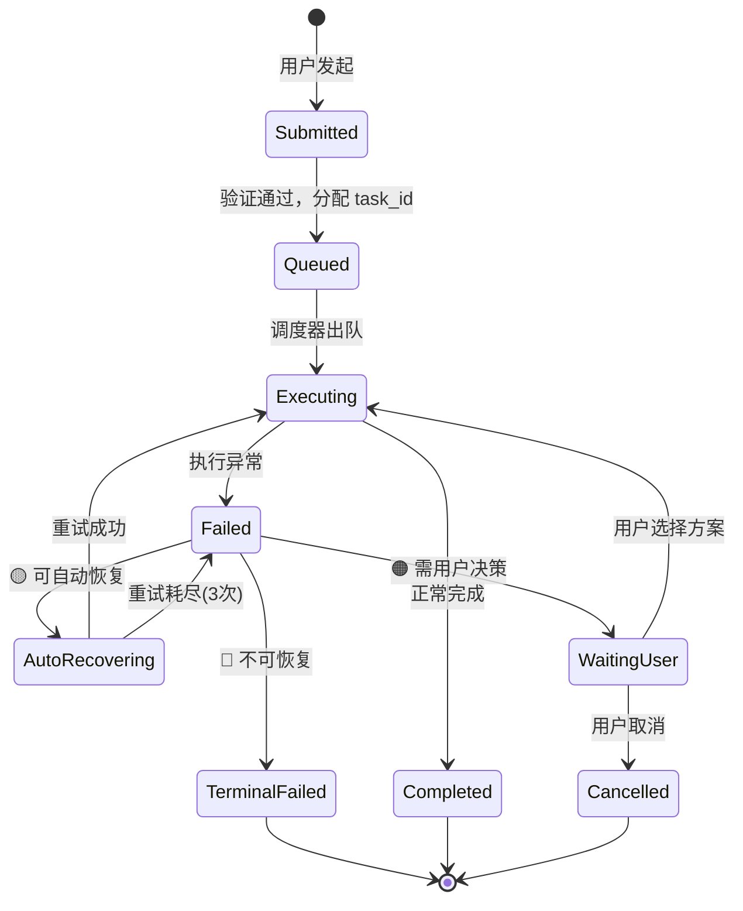
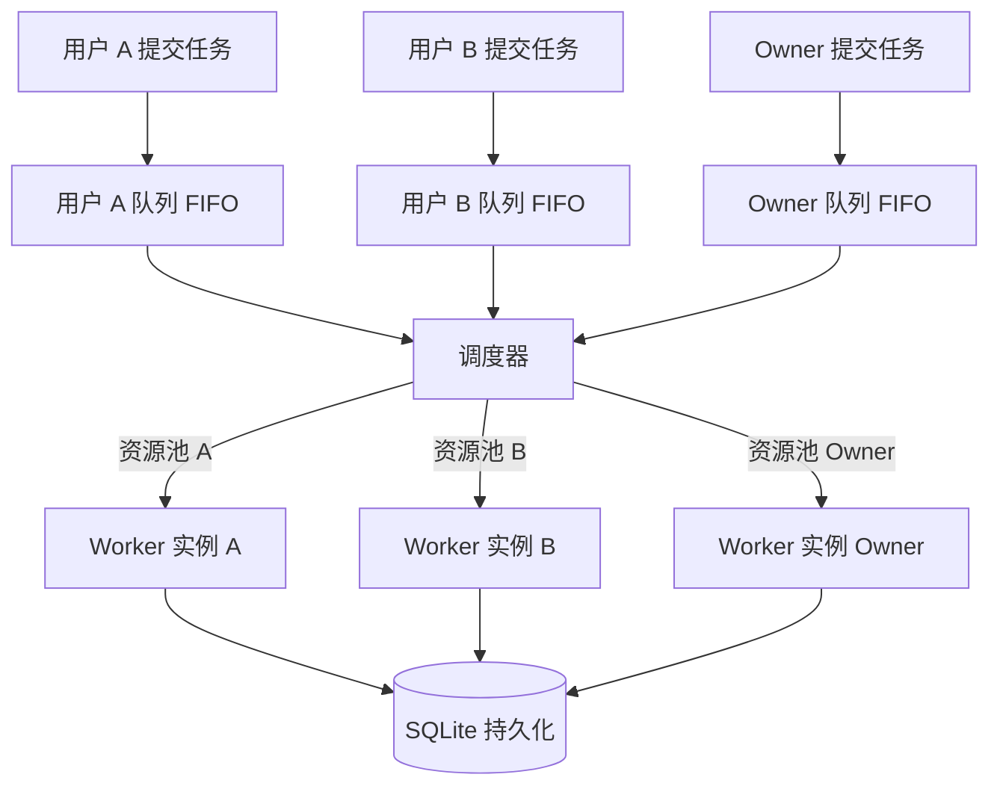
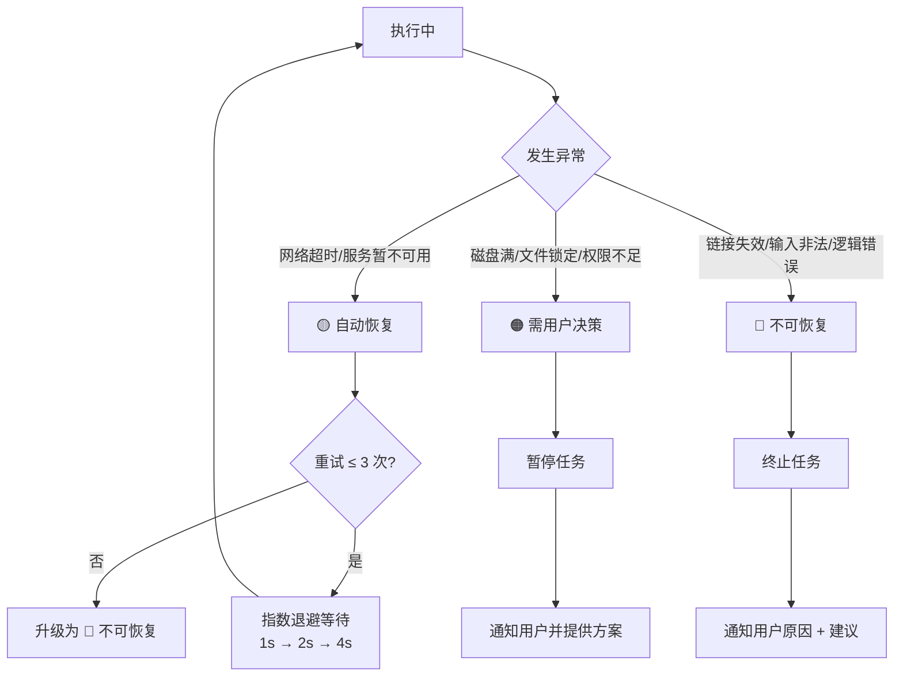
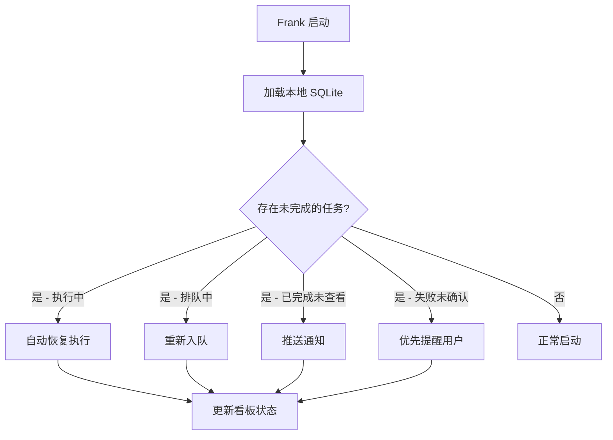
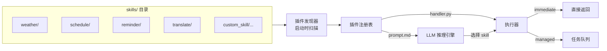
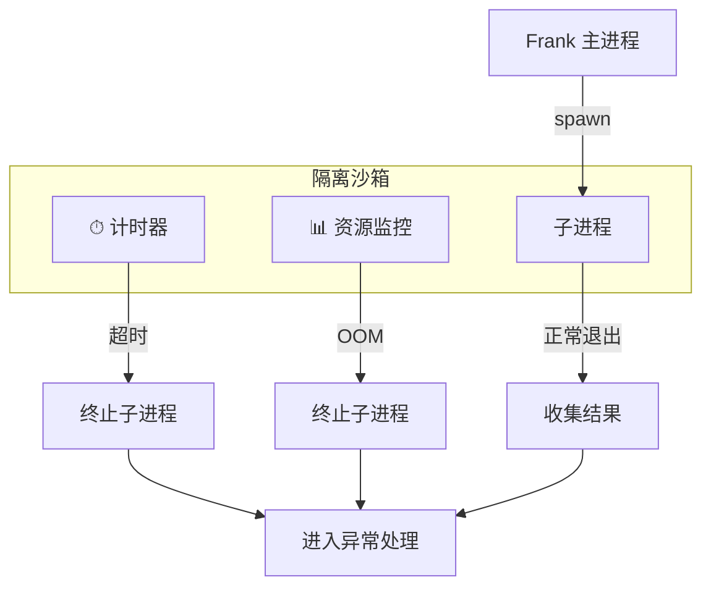
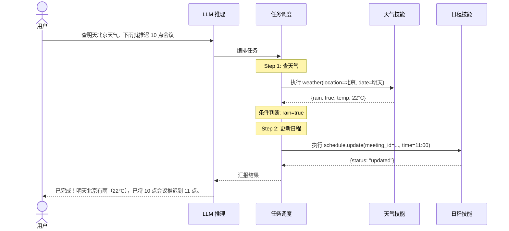
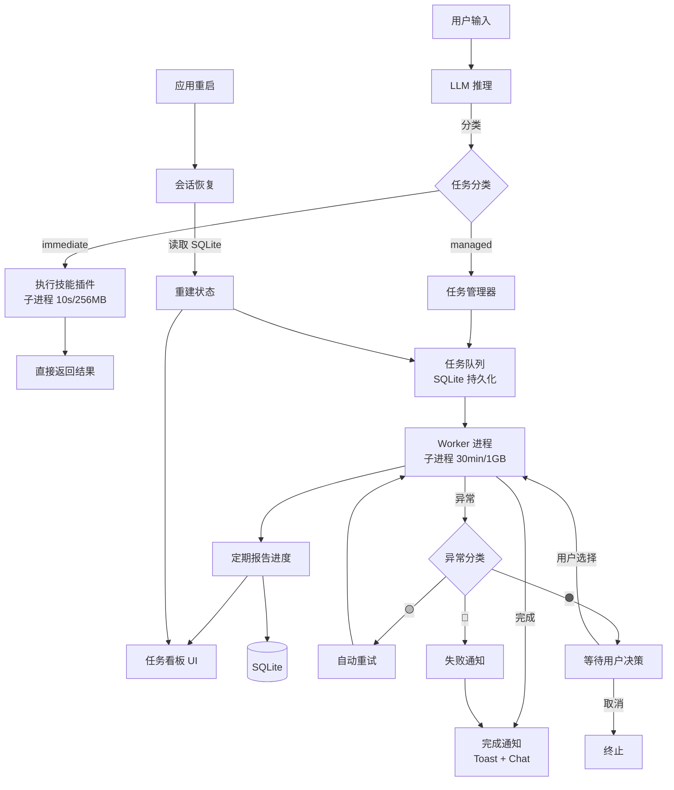

# Frank 后台任务管理系统 & 技能插件体系设计

> 版本: v0.1
> 日期: 2026-05-30
> 状态: 草案

---

## 目录

1. [设计目标](#1-设计目标)
2. [命令分类与路由](#2-命令分类与路由)
3. [托管任务生命周期](#3-托管任务生命周期)
4. [任务队列调度](#4-任务队列调度)
5. [异常处理三层级](#5-异常处理三层级)
6. [任务看板 UI](#6-任务看板-ui)
7. [会话恢复机制](#7-会话恢复机制)
8. [完成通知](#8-完成通知)
9. [技能插件系统](#9-技能插件系统)
10. [插件执行隔离](#10-插件执行隔离)
11. [多技能编排](#11-多技能编排)
12. [内置技能清单](#12-内置技能清单)

---

## 1. 设计目标

Frank 在服务于用户的日常生活和工作场景中，需要处理两类截然不同的请求：

- **即时命令**：查询天气、翻译一句话、问一个知识——毫秒到秒级响应，用户等待结果返回即可。
- **托管任务**：压缩照片文件夹、分析一周日程并生成报告、批量处理文档——耗时数十秒到数分钟，用户不应阻塞等待。

本规范定义 Frank 的**后台任务管理系统**（Managed Task System）和**技能插件体系**（Skill Plugin System），使 Frank 能优雅地调度、监控、恢复和通知长时间运行的任务，同时通过插件架构保持技能的可扩展性。

---

## 2. 命令分类与路由

LLM 对用户输入进行意图识别时，输出 `task_type` 标签决定命令路由。

```json
{
  "task_type": "immediate | managed",
  "estimated_duration_ms": 500,
  "skill": "weather",
  "params": { ... }
}
```

| 分类 | 响应时间 | 路由 | 用户感知 |
|------|---------|------|---------|
| `immediate` | 毫秒~秒级 | 直接在当前线程执行并返回 | 即时回复，无中间状态 |
| `managed` | 秒~分钟级 | 推入任务队列，返回 `task_id` | 收到任务 ID + 进度查询入口 |

### 分类规则（LLM 判定依据）

- 任何涉及**文件 IO**、**网络批量请求**、**长时间计算**、**多步骤编排**的操作 → `managed`
- 单次 API 查询、简单计算、纯文本生成 → `immediate`
- 不确定时默认 `managed`（安全侧），用户可以随时中断。

### 路由流程

```
用户输入 → LLM 意图识别 + task_type 判定
         ├── immediate → 执行技能 → 返回结果
         └── managed   → 分配 task_id → 入队 → 返回 task_id + 查询方式
```

---

## 3. 托管任务生命周期

### 状态机



### 状态定义

| 状态 | 含义 | 用户可见信息 |
|------|------|-------------|
| `Submitted` | 任务已提交，等待验证 | - |
| `Queued` | 排队中 | 队列位置 + 预估等待时间 |
| `Executing` | 执行中 | 进度百分比 + 预估剩余时间 |
| `Completed` | 完成 | 结果链接 / 摘要 |
| `Failed` | 失败（进入异常处理） | 失败原因 + 处理方案 |
| `AutoRecovering` | 自动重试中 | 当前重试次数(1/3) |
| `WaitingUser` | 等待用户决策 | 可选项按钮 |
| `TerminalFailed` | 最终失败 | 失败原因 + 建议 |
| `Cancelled` | 用户取消 | - |

### 用户交互示例

```
用户：我的照片压缩好了吗？
Frank：正在查看「照片压缩」任务……
       当前状态：执行中 | ████████░░ 80%
       已处理 160/200 张图片，预计剩余 30 秒
```

---

## 4. 任务队列调度



### 调度规则

| 原则 | 规则 |
|------|------|
| **同用户 FIFO** | 同一用户的任务严格按提交顺序执行 |
| **跨用户并行** | 不同用户的任务使用独立的资源池，互不阻塞 |
| **Owner 特权** | Owner（管理员）可以查看所有用户任务、调整优先级、取消任意任务 |
| **资源隔离** | 每个用户享有独立配额（最大并发数、CPU/内存上限） |
| **角色贯穿** | 任务的 role context 在提交时绑定，执行过程中的所有权限校验均基于此上下文 |

### 队列持久化

每个任务记录包含：

| 字段 | 类型 | 说明 |
|------|------|------|
| `task_id` | UUID v4 | 全局唯一 |
| `user_id` | string | 提交者 |
| `status` | enum | 当前状态 |
| `priority` | int | 优先级(默认 0，Owner 可调) |
| `queue_position` | int | 在用户队列中的位置 |
| `progress_pct` | int | 0~100 |
| `estimated_remaining_s` | int | 预估剩余秒数 |
| `result_json` | text | 结果数据 |
| `error_info` | text | 异常详情 |
| `created_at` | datetime | 提交时间 |
| `updated_at` | datetime | 最后变更时间 |

---

## 5. 异常处理三层级

异常处理是任务系统的核心体验设计。**每条异常消息必须包含三要素**：
1. **发生了什么**（简明中文描述）
2. **为什么**（根本原因，非技术语言）
3. **怎么办**（可操作方案，而非"请稍后重试"）



### 5.1 🟡 自动恢复（黄色）

| 场景 | 重试策略 | 用户可见 |
|------|---------|---------|
| 网络超时 | 指数退避 1s/2s/4s，最多 3 次 | 每次重试更新进度："网络波动，自动重试中(2/3)" |
| 服务 503 | 同上 | 同上 |
| 临时资源锁 | 退避 2s 后重试 | 同上 |

**失败 × 3 后升级为 🔴**。

### 5.2 🟠 需用户决策（橙色）

| 场景 | 通知示例 |
|------|---------|
| 磁盘空间不足 | "压缩失败——磁盘空间仅剩 200MB，需要 800MB。方案 1：清理临时文件？方案 2：存到 D 盘？" |
| 文件被占用 | "文件 `report.xlsx` 正在被其他程序打开。方案 1：等待关闭后再试？方案 2：跳过此文件？" |
| 权限不足 | "没有权限写入 `C:\Program Files` 目录。方案 1：改存到桌面？方案 2：以管理员身份运行？" |

用户选择方案后，任务恢复执行。用户取消则任务终止。

### 5.3 🔴 不可恢复（红色）

| 场景 | 通知示例 |
|------|---------|
| 下载链接已失效 | "无法下载文件——链接已失效（404）。建议：重新获取有效链接后重试。输入"重新下载"以再次尝试。" |
| 输入数据格式错误 | "无法分析日程——提供的 Excel 文件格式不正确，缺少"日期"列。建议：检查文件模板后重新上传。" |
| 内部逻辑错误 | "计算过程中遇到了意外错误。建议：联系开发者查看日志（错误码 E-1004）。" |

不再自动重试，任务进入 `TerminalFailed`，等待用户发出新的指令。

---

## 6. 任务看板 UI

### 主面板布局

```
┌─────────────────────────────────────────────────────────┐
│  🔔 Frank 任务中心                          [+ 新建]   │
├─────────────────────────────────────────────────────────┤
│  进行中 (3)                                               │
│  ┌──────┬────────────┬──────────┬──────────┬──────────┐ │
│  │ ID   │ 任务名称    │ 进度      │ 状态      │ 操作      │ │
│  ├──────┼────────────┼──────────┼──────────┼──────────┤ │
│  │ #042 │ 照片压缩    │ ████░░ 62% │ 执行中    │ [查看]    │ │
│  │ #041 │ 周报生成    │ ████████ 90% │ 执行中    │ [查看]    │ │
│  │ #040 │ 视频转码    │ ██░░░░ 18% │ 排队中    │ [取消]    │ │
│  └──────┴────────────┴──────────┴──────────┴──────────┘ │
│                                                         │
│  已完成 / 最近 24 小时 (5)                                │
│  ┌──────┬────────────┬──────────┬──────────┬──────────┐ │
│  │ #039 │ 天气查询    │ 100%     │ ✅ 完成   │ [查看]    │ │
│  │ #038 │ 会议安排    │ 100%     │ ✅ 完成   │ [查看]    │ │
│  │ #037 │ 文件备份    │ -        │ ❌ 失败   │ [重试]    │ │
│  └──────┴────────────┴──────────┴──────────┴──────────┘ │
└─────────────────────────────────────────────────────────┘
```

### 权限规则

| 角色 | 可见范围 | 可操作 |
|------|---------|--------|
| 普通用户 | 仅自己的任务 | 查看、取消、重试自己的任务 |
| Owner | 所有用户的任务 | 查看、取消、重试、调整优先级、重新分配 |

### 进度条更新机制

- 技能执行器定期调用 `task.report_progress(percent, message)` 回写进度
- 看板通过 WebSocket 或轮询（每 2s）刷新
- 进度更新也写入 SQLite，用于会话恢复

---

## 7. 会话恢复机制



### 恢复规则

| 应用关闭前状态 | 重启后行为 |
|---------------|-----------|
| `Executing` | 自动重建 Worker 子进程，从最后一个检查点恢复执行 |
| `Queued` | 重新入队，按原顺序排队 |
| `Completed`（用户未查看） | 弹窗通知："您有 X 个任务已完成" |
| `Failed`（用户未确认） | 优先在聊天面板推送："有 Y 个任务失败，请确认处理" |
| `WaitingUser` | 恢复等待状态，重新提示用户选择方案 |

### 持久化存储

- 使用本地 SQLite 数据库 `~/.frank/tasks.db`
- 每 5 秒或每次进度变更时写入 checkpoint
- 结果文件存储在 `~/.frank/results/{task_id}/` 目录

---

## 8. 完成通知

### 通知渠道

| 渠道 | 触发条件 | 内容 |
|------|---------|------|
| Windows Toast | 任务完成/失败 | 任务名称 + 状态 + 耗时 |
| 聊天面板消息追加 | 任务完成/失败 | 详细结果 + 操作按钮 |

### Toast 通知格式

```
Frank - 任务完成 ✅
─────────────────
照片压缩已完成
处理 200 张图片，节省 1.2GB 空间
耗时：45 秒
─────────────────
[查看结果]
```

### 聊天面板追加

原始消息下方追加：

```
> 任务 #042「照片压缩」已提交，任务 ID: 042
> 进度查询：输入"查询任务 042"

──── 45 秒后 ────

✅ 任务 #042「照片压缩」已完成！
📁 结果：output/compressed_photos.zip (1.2GB)
[查看详情] [下载] [再次压缩]
```

---

## 9. 技能插件系统

### 架构总览



### 插件目录规范

每个技能插件是一个独立目录，放置在 `skills/` 下。

```
skills/
├── weather/
│   ├── manifest.json      # 插件元数据
│   ├── handler.py         # 核心逻辑
│   └── prompt.md          # LLM 提示上下文
├── schedule/
│   ├── manifest.json
│   ├── handler.py
│   └── prompt.md
├── reminder/
│   ├── manifest.json
│   ├── handler.py
│   └── prompt.md
├── translate/
│   ├── manifest.json
│   ├── handler.py
│   └── prompt.md
└── custom_skill/
    ├── manifest.json
    ├── handler.py
    └── prompt.md
```

### manifest.json

```json
{
  "name": "photo_compress",
  "version": "1.0.0",
  "display_name": "照片压缩",
  "description": "批量压缩照片，支持格式转换和尺寸调整",
  "trigger_keywords": ["压缩", "图片", "照片", "缩小"],
  "min_user_level": 0,
  "permissions": {
    "network": false,
    "file_read": ["~/Pictures/**/*.{jpg,png,heic}"],
    "file_write": ["~/Pictures/compressed/"]
  },
  "estimated_runtime": "managed",
  "estimated_duration_ms": 30000,
  "output_type": "file",
  "timeout_ms": 1800000,
  "memory_mb": 1024
}
```

| 字段 | 说明 |
|------|------|
| `name` | 插件唯一标识，kebab-case |
| `display_name` | 用户可见的中文名称 |
| `trigger_keywords` | LLM 判定是否调用此技能的触发词 |
| `min_user_level` | 最低用户权限等级（0=所有人，1=VIP，2=管理员） |
| `permissions` | 声明所需的网络和文件访问权限 |
| `estimated_runtime` | `immediate` 或 `managed` |
| `estimated_duration_ms` | 预估执行时间，供调度参考 |
| `output_type` | `text` / `file` / `json` |
| `timeout_ms` | 超时上限 |
| `memory_mb` | 内存上限 |

### prompt.md 示例

````markdown
# 照片压缩技能 (photo_compress)

## 触发条件
用户在以下场景应该调用此技能：
- 提到"压缩照片"、"缩小图片"、"批量处理图片"
- 要求将图片文件转为更小的格式

## 调用参数
- source_path: 源文件或目录路径
- output_format: "jpg" | "webp" | "avif"（默认 webp）
- quality: 1-100（默认 80）
- max_width: 最大宽度像素（可选）

## 注意事项
- 此任务为托管任务（managed），预计耗时取决于文件数量和大小
- 大文件建议转 webp 格式以平衡大小和质量
- 不支持动图（GIF）压缩
````

### 自动发现与注册

```
Frank 启动
  → 扫描 skills/ 目录下的所有子目录
  → 每个子目录读取 manifest.json 验证格式
  → 验证通过则注册到插件注册表
  → 读取 prompt.md 拼接至 LLM 系统提示词
```

- 插件注册表维护在内存中，启动时构建
- 运行期间可通过热加载命令 `frank plugin reload` 重新扫描
- 格式不合法的插件被跳过并记录警告日志

---

## 10. 插件执行隔离



### 资源限制

| 命令类型 | 超时 | 内存限制 | 网络 | 文件访问 |
|---------|------|---------|------|---------|
| `immediate` | 10s | 256MB | 按 manifest 声明 | 按 manifest 声明路径 |
| `managed` | 30min | 1GB | 按 manifest 声明 | 按 manifest 声明路径 |

### 隔离机制

| 维度 | 实现方式 |
|------|---------|
| 进程隔离 | 每个插件在独立子进程中执行，使用 `subprocess` 或 `multiprocessing` |
| 超时控制 | 主进程启动定时器，超时后发送 `SIGTERM` → 2s 后 `SIGKILL` |
| 内存限制 | 使用 `resource` 模块（Linux/macOS）或 Windows Job Object 设置内存配额 |
| 网络限制 | 按 manifest 声明：无网络需求的插件禁止网络访问（通过防火墙规则或代理配置控制） |
| 文件沙箱 | 文件读写限定在 manifest 声明的路径范围内调用前校验路径合法性 |

### 异常映射

| 子进程退出原因 | 映射异常层级 |
|--------------|------------|
| 超时 (`exit code -15`) | 🟡 自动恢复（重试 1 次后变 🔴） |
| OOM (`exit code -9`) | 🟡 自动恢复（重试 1 次后变 🔴） |
| 网络不可达 | 🟡 自动恢复 |
| 文件写入权限错误 | 🟠 需用户决策 |
| 代码异常 (`exit code 1`) | 🔴 不可恢复 |

---

## 11. 多技能编排

LLM 能够将复杂命令拆解为多个技能调用并按顺序编排，而非使用硬编码的管道。

```
用户：查查明天北京的天气，如果下雨就推迟 10 点会议
                                        │
                                        ▼
                          LLM 任务分解与编排
                                        │
                        ┌───────────────┴───────────────┐
                        ▼                               ▼
               Step 1: weather(location=北京)    Step 2: 条件判断
                        │                        ┌─────┴─────┐
                        ▼                        ▼           ▼
                  返回: 明天有雨               是(下雨)     否(不下雨)
                                               │           │
                                               ▼           ▼
                                        Step 2a:        结束
                                        schedule.update(
                                          meeting_id=10,
                                          time=11:00
                                        )
```



### 编排原则

| 原则 | 说明 |
|------|------|
| **LLM 驱动** | LLM 决定调用顺序、条件分支和参数传递，非硬编码管道 |
| **步骤可追踪** | 每个步骤作为一个子任务出现在看板中，可查看当前执行到哪一步 |
| **步骤间失败隔离** | 某一步骤失败不影响已完成的前序步骤，LLM 决定是否回滚 |
| **结果传递** | 上一步的输出作为下一步的输入上下文 |

### 看板中的多步任务展示

```
┌──────────────────────────────────────────────────┐
│  #100 综合任务：查天气 + 调整日程                 │
│  ├── ✅ Step 1: 查询北京天气                      │
│  ├── 🔄 Step 2: 推迟 10 点会议（执行中）          │
│  └── ⏳ Step 3: 通知参会者（排队中）              │
│  总体进度：██████░░░░ 50%                         │
└──────────────────────────────────────────────────┘
```

---

## 12. 内置技能清单

Frank 首次启动时预装以下技能，开箱即用。

| 技能名 | display_name | 分类 | 说明 |
|--------|-------------|------|------|
| `weather` | 天气查询 | `immediate` | 查询任意城市实时天气和未来预报 |
| `schedule` | 日程管理 | `managed` | 创建、查询、修改、删除日历事件，支持 ICS 导入导出 |
| `reminder` | 提醒 | `managed` | 设置定时提醒，到点推送通知 |
| `translate` | 翻译 | `immediate` | 多语言文本翻译，支持 50+ 语言 |

### 自定义技能

用户或开发者通过放置目录到 `skills/` 下来添加自定义技能：

```
skills/
├── weather/          # 内置
├── schedule/         # 内置
├── reminder/         # 内置
├── translate/        # 内置
└── my_tool/          # 自定义
    ├── manifest.json
    ├── handler.py
    └── prompt.md
```

无需修改 Frank 核心代码，放入即用，重启或执行 `frank plugin reload` 生效。

---

## 附录 A：数据流全景图



---

## 附录 B：关键设计决策总结

| 决策 | 选型 | 理由 |
|------|------|------|
| **任务持久化** | 本地 SQLite | 无外部依赖，即开即用，支持会话恢复 |
| **进程隔离** | OS 子进程 | 强隔离性，无解释器 GIL 限制，资源可精确控制 |
| **异常三色模型** | 🟡🟠🔴 | 覆盖所有故障场景，用户体验分层清晰 |
| **插件声明式** | manifest.json + prompt.md | 与 LLM 推理自然结合，无需硬编码路由 |
| **多步编排** | LLM 驱动 | 灵活性强，无需预定义工作流 DAG |
| **同用户 FIFO** | 按用户分队列 | 保证同一用户任务有序，不同用户互不干扰 |
| **Windows 优先** | Toast Notification | 桌面环境原生体验，后续可扩展其他平台 |
