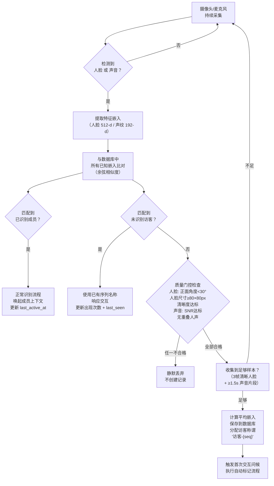
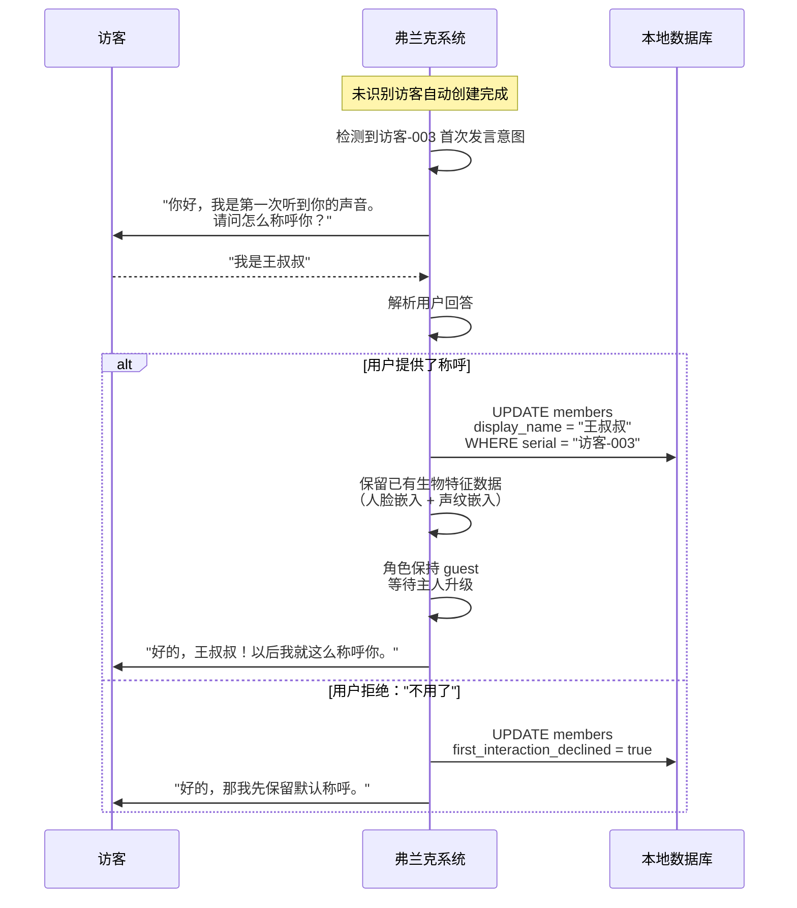
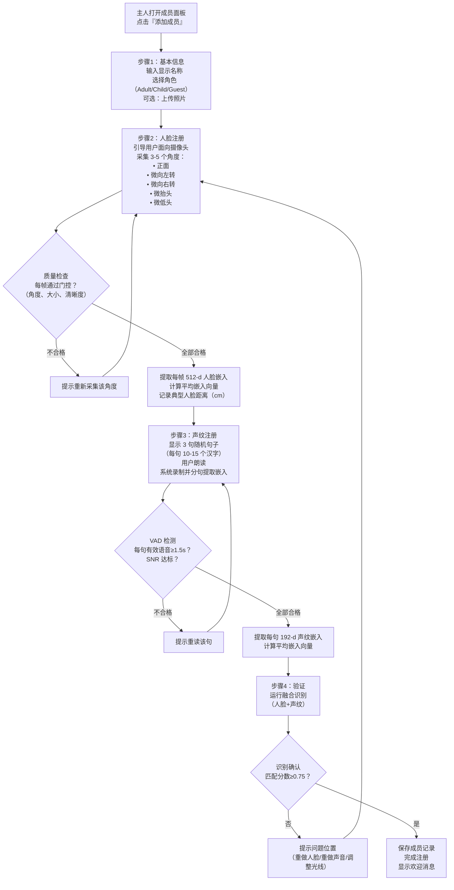
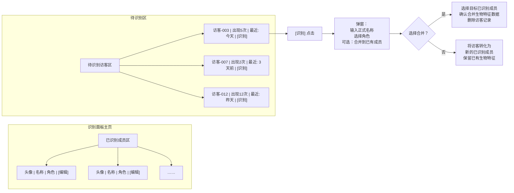
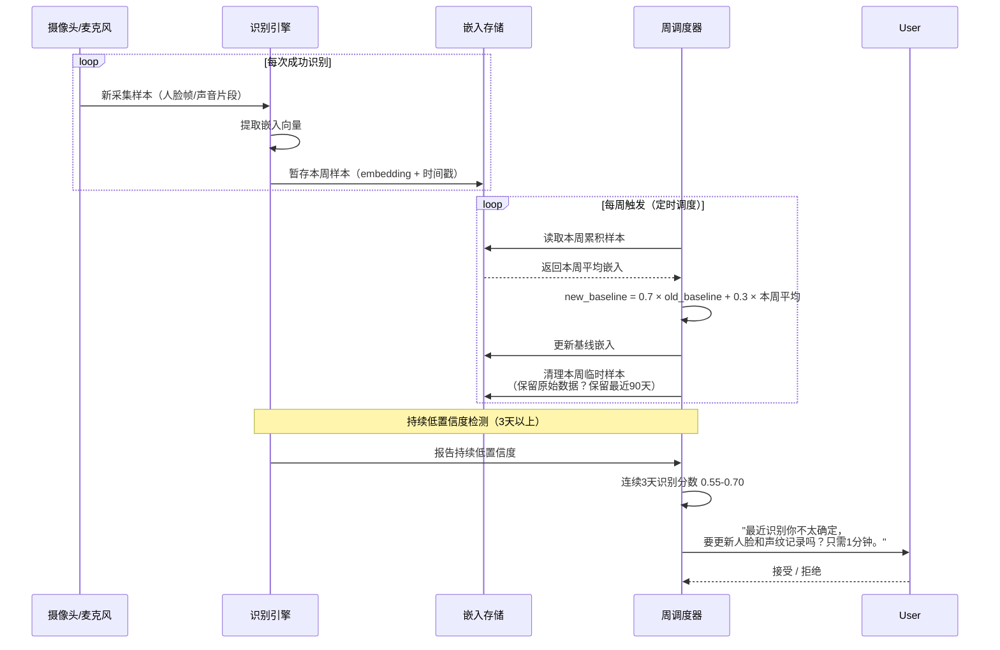
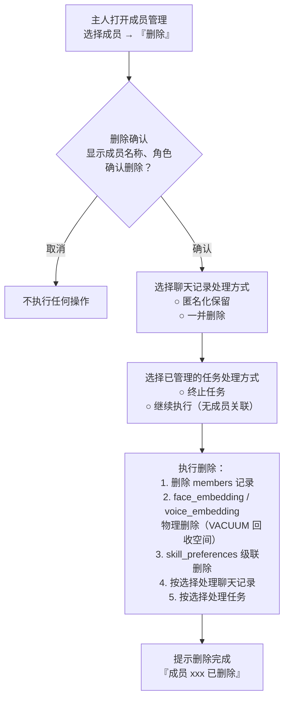
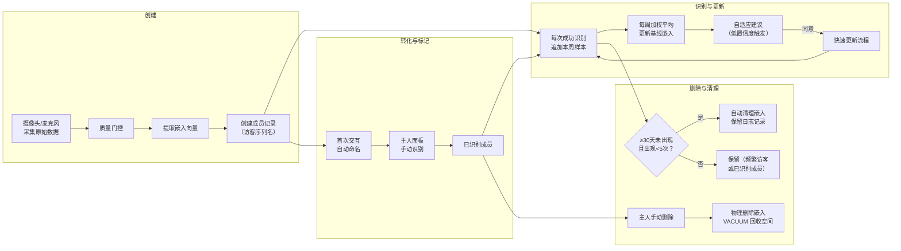
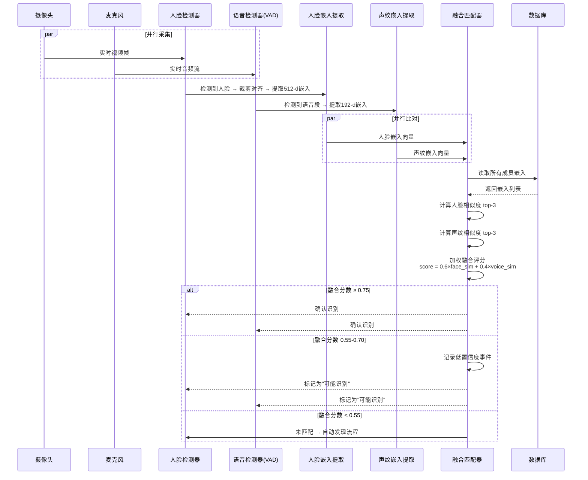

# 弗兰克 —— 成员管理与生物特征数据设计

> **文档编号**: FRANK-SPEC-005  
> **状态**: 草案  
> **创建日期**: 2026-05-30  
> **负责人**: Rowen  
> **相关模块**: 成员管理、生物特征识别、自动发现流水线、姿态手势预留

---

## 1. 概述

弗兰克的成员与生物特征系统负责管理两类人群（已识别成员与未识别访客），提供从自动发现、注册登记、识别匹配到特征维护的完整生命周期。核心原则：

- **隐私优先**: 生物特征嵌入向量为不可逆特征表示，无法还原为原始图像或音频；所有数据存储在本地 SQLite，永不离开设备、永不联网传输。
- **双身份源**: 系统同时支持已识别成员（由主人手动注册或由未识别访客转化而来）和未识别访客（自动检测的新面孔/新声音）。
- **自适应进化**: 每次成功识别均采集新样本，按周进行加权平均更新，使特征模板随用户自然变化（发型、年龄、嗓音状态等）逐步适应。

---

## 2. 双身份源模型

```
                    ┌─────────────────────────────────────┐
                    │         弗兰克成员管理系统            │
                    ├──────────────────┬──────────────────┤
                    │   已识别成员      │   未识别访客      │
                    │  (Identified)    │  (Unidentified)   │
                    ├──────────────────┼──────────────────┤
                    │ • 有显示名称      │ • 自动分配的      │
                    │ • 有角色          │   序列名称        │
                    │   (owner/adult/   │   "访客-001"     │
                    │    child/guest)   │ • 默认 Guest 角色 │
                    │ • 完成人脸+声纹    │ • 可转化为        │
                    │   注册流程         │   已识别成员      │
                    │ • 完整交互权限      │ • 受限交互权限    │
                    └──────────────────┴──────────────────┘
```

### 2.1 已识别成员 (Identified Member)

| 属性 | 说明 |
|---|---|
| 创建方式 | 主人手动注册，或未识别访客经首次交互自动标记转化 |
| 显示名称 | 主人指定的中文称谓（如 "小明"、"王叔叔"） |
| 角色 | owner / adult / child / guest（见图灵权限控制） |
| 生物特征 | 完成人脸嵌入 + 声纹嵌入双重注册 |
| 交互权限 | 依角色而定：owner 拥有全部管理权限 |

### 2.2 未识别访客 (Unidentified Person)

| 属性 | 说明 |
|---|---|
| 创建方式 | 摄像头/麦克风持续采集 → 检测到新面孔/新声音 → 自动创建 |
| 显示名称 | 序列化自动命名："访客-001"、"访客-002"…… |
| 默认角色 | guest |
| 生物特征 | 自动采集的嵌入向量，质量门槛严格控制 |
| 首次交互 | 触发自动命名流程："请问怎么称呼你？" |

---

## 3. 自动发现流程



### 3.1 匹配阈值

| 比较类型 | 匹配阈值 | 说明 |
|---|---|---|
| 人脸嵌入余弦相似度 | ≥ 0.70 | 高确定性匹配 |
| 声纹嵌入余弦相似度 | ≥ 0.65 | 环境噪声容忍度略低 |
| 融合识别（人脸+声纹） | 加权融合分 ≥ 0.75 | 双模态确认 |
| 待定区（可能匹配） | 0.55 - 0.70 | 触发自适应更新建议 |

### 3.2 质量门控

系统通过质量门控确保入库的嵌入模板具有可比性：

**人脸帧要求**:
- 正面角度偏差 < 30°（偏航角、俯仰角、翻滚角）
- 人脸检测框 ≥ 80×80 px
- 清晰度分数 > 阈值（Laplacian 方差法）
- 两眼可见，无严重遮挡

**声音片段要求**:
- 信噪比（SNR）> 15 dB
- 有效语音时长 ≥ 1.5 秒
- 单声道无重叠人声（VAD + 说话人日志）
- 非静音段占比 > 60%

---

## 4. 首次交互自动标记流程



### 4.1 自动标记规则

- 用户提供的称呼自动进行简单清洗（去首尾空格、截断至 20 字符）
- 已存在的 display_name 不允许重复（提示 "这个名字已经被使用了"）
- 自动标记 **不改变角色**，访客仍为 guest 角色，需由主人手动提升
- 若访客之前已积累生物特征样本，**全部继承**至新记录
- 拒绝命名的访客不会再次触发该流程，除非手动重置

---

## 5. 主人注册流程



### 5.1 注册界面指引

每个注册步骤提供明确的视觉/语音引导：

- **步骤2**: 实时显示人脸检测框 + 角度指示器 + 当前采集进度（3/5）。绿色框表示通过，红色框重新调整。
- **步骤3**: 句子池包含约 50 句覆盖所有普通话声韵母的句子，确保声纹特征多样性。每句显示在屏幕上，用户朗读后自动切到下一句。
- **步骤4**: 显示融合分数动画，展示人脸和声音各自的匹配分数。

### 5.2 典型人脸距离

在注册步骤2中，系统记录用户距离摄像头的典型距离（cm），用于后续识别阶段的尺度归一化和摄像头自动变焦参考。

---

## 6. 主人识别面板



### 6.1 面板功能说明

- **已识别成员区**: 按最近活跃时间倒序排列，显示成员头像（如有）、显示名称、角色标签。编辑按钮可修改名称、角色、或重新注册生物特征。
- **待识别访客区**: 按最近出现时间倒序排列，显示序列名称、累计出现次数、最后出现时间。[识别] 按钮触发命名流程。
- **合并功能**: 当主人发现访客-003 实际上是戴了帽子的小明时，可选择合并到已有成员 "小明"。合并操作将访客的生物特征数据追加到目标成员的嵌入池中，丰富识别模板，然后删除访客记录。

---

## 7. 生物特征存储

### 7.1 数据库设计

本地 SQLite 数据库位于 AppData 目录（Windows: `%APPDATA%/Frank/data/frank.db`）。

**members 表**:

```sql
CREATE TABLE members (
    id              INTEGER PRIMARY KEY AUTOINCREMENT,
    serial_name     TEXT    NOT NULL,           -- 内部序列名 "visitor-003"
    display_name    TEXT,                       -- 显示名称，NULL 表示未命名访客
    role            TEXT    NOT NULL DEFAULT 'guest',  -- owner|adult|child|guest
    face_embedding  BLOB,                       -- 512 个 float32，总计 2048 字节
    typical_distance_cm REAL,                   -- 典型人脸距离（厘米）
    voice_embedding BLOB,                       -- 192 个 float32，总计 768 字节
    created_at      TEXT    NOT NULL DEFAULT (datetime('now')),
    last_active_at  TEXT,
    appearance_count INTEGER DEFAULT 1,         -- 累计出现次数
    first_interaction_declined INTEGER DEFAULT 0, -- 拒绝命名标记
    is_owner        INTEGER DEFAULT 0,          -- 是否为设备主人
    is_active       INTEGER DEFAULT 1           -- 软删除标记
);

CREATE INDEX idx_members_display ON members(display_name);
CREATE INDEX idx_members_role ON members(role);
CREATE INDEX idx_members_last_active ON members(last_active_at);
```

**skill_preferences 表**:

```sql
CREATE TABLE skill_preferences (
    id          INTEGER PRIMARY KEY AUTOINCREMENT,
    member_id   INTEGER NOT NULL REFERENCES members(id) ON DELETE CASCADE,
    skill_name  TEXT    NOT NULL,
    enabled     INTEGER DEFAULT 1,
    config_json TEXT,                           -- 按需扩展的技能配置
    UNIQUE(member_id, skill_name)
);
```

### 7.2 安全约束

| 原则 | 说明 |
|---|---|
| 本地存储 | 所有生物特征数据仅存在于设备本地 SQLite |
| 永不联网 | 嵌入向量不通过任何网络接口传输 |
| 不可逆性 | 嵌入向量为浮点数组，无法还原为原始图像或音频 |
| 访问控制 | 仅在主人活动会话中可读；子成员/访客会话无读取权限 |
| 加密存储 | SQLite 数据库文件整体加密（SQLCipher），密钥派生自设备密钥 |

### 7.3 数据类型说明

| 字段 | 具体格式 |
|---|---|
| face_embedding | 512 个 float32 小端序连续存储（2048 字节） |
| voice_embedding | 192 个 float32 小端序连续存储（768 字节） |
| typical_distance_cm | REAL，范围 30.0 - 300.0 |
| created_at / last_active_at | ISO 8601 字符串 "YYYY-MM-DD HH:MM:SS" |

---

## 8. 自适应嵌入更新



### 8.1 更新算法

```
每周更新公式:
  new_baseline = 0.7 × old_baseline + 0.3 × week_avg

其中 week_avg 为本周内所有成功识别的嵌入向量的逐元素平均值。

若当周无成功识别:
  new_baseline = old_baseline（保持不变，衰减系数不计）
```

### 8.2 持续低置信度触发

- **监控窗口**: 连续 3 个自然日
- **触发条件**: 每日平均融合识别分数在 0.55 - 0.70 之间
- **建议频率**: 同一成员 14 天内最多触发 1 次，避免骚扰
- **流程**: 触发建议 → 用户确认 → 启动快速注册流程（仅需正面人脸 + 1 句语音，约 30 秒）→ 替换基线嵌入

---

## 9. 成员删除



### 9.1 删除策略

| 操作 | 具体行为 |
|---|---|
| 嵌入向量 | 物理删除，执行 VACUUM 回收页面空间 |
| 聊天记录 | 可选匿名化（替换 display_name 为 "已删除用户"）或级联删除 |
| 已管理的任务 | 可选终止任务或将任务转为无人值守状态 |
| 级联清理 | skill_preferences ON DELETE CASCADE 自动清理 |
| 唯一限制 | 不允许删除 owner 角色的最后一个成员 |

---

## 10. 未识别人群自动清理

### 10.1 清理规则

| 条件 | 行为 |
|---|---|
| 未出现时间 ≥ 30 天 | 标记为待清理 |
| 且：appearance_count < 5 | 自动清理生物特征数据 |
| 且：appearance_count ≥ 5 | 保留（频繁访客，主人可能即将识别） |
| 且：清理前 3 天 | 推送通知给主人预览待清理列表 |

### 10.2 清理通知

```
─────────────────────────────
    🏠 访客清理提醒
─────────────────────────────
以下访客已超过 30 天未出现，
将于 3 天后自动清理生物特征数据：

· 访客-005（上次出现：45 天前）
· 访客-008（上次出现：32 天前）
· 访客-012（上次出现：60 天前，出现 15 次） ← 频繁访客，将保留

点击查看详情 → [查看]
─────────────────────────────
```

### 10.3 设置选项

| 设置项 | 默认值 | 说明 |
|---|---|---|
| 自动清理未识别访客 | 开启 | 主开关 |
| 清理周期（天） | 30 | 可配置 15-90 天 |
| 清理前通知（天） | 3 | 可配置 0-7 天 |
| 保留频繁访客 | 开启 | 出现次数 ≥ 5 不受清理影响 |

---

## 11. 数据生命周期总览



---

## 12. 姿态/手势识别模块（预留）

### 12.1 设计说明

此模块为第一阶段预留接口，定义 API 但不实现。具体实现纳入后续阶段规划。

### 12.2 PoseModule 接口定义

```python
from dataclasses import dataclass, field
from typing import Optional, Callable
import numpy as np

@dataclass
class PoseFrame:
    """单帧姿态数据"""
    body_landmarks: np.ndarray     # shape (33, 3)  — BlazePose 33 关键点 (x, y, confidence)
    left_hand_landmarks: np.ndarray   # shape (21, 3)  — MediaPipe 左手关键点
    right_hand_landmarks: np.ndarray  # shape (21, 3)  — MediaPipe 右手关键点
    frame_timestamp: float             # 时间戳（秒）

@dataclass
class GestureEvent:
    """识别到的手势事件"""
    gesture_type: str               # "raise_hand"|"point"|"wave"|"come_closer"|"custom"
    confidence: float               # 0.0 - 1.0
    gesture_id: Optional[str]       # 自定义手势 ID，custom 类型必填
    pose_sequence: list[PoseFrame]  # 触发该手势的关键帧序列

class PoseModule:
    """
    姿态/手势识别模块。

    第一阶段仅定义接口，不实现具体功能。
    由子模块 frank-pose 在第二阶段完成实现。
    """

    def extract_pose(self, frame: np.ndarray) -> Optional[PoseFrame]:
        """
        从单帧 RGB 图像中提取人体姿态和双手关键点。

        技术选型:
        - MediaPipe Pose (BlazePose) — 33 个身体关键点
        - MediaPipe Hands — 每手 21 个关键点

        Returns:
            PoseFrame 或 None（未检测到人体时）
        """
        raise NotImplementedError("Phase 2 implementation")

    def classify_gesture(self, sequence: list[PoseFrame]) -> GestureEvent:
        """
        对一段连续姿态帧序列进行分类，识别预定义手势。

        实现方案: 轻量级分类器（基于关键点序列的时序模型）
        - 可选方案: 1D-CNN / LSTM / 规则引擎
        - 分类标签: raise_hand, point, wave, come_closer, custom

        Returns:
            GestureEvent（若无匹配手势，confidence < 0.5）
        """
        raise NotImplementedError("Phase 2 implementation")

    def register_custom_gesture(
        self, name: str, sequence: list[PoseFrame]
    ) -> str:
        """
        注册用户自定义手势。

        用户演示一遍完整手势动作 → 录制关键点序列 →
        提取运动特征 → 存入自定义手势数据库 → 返回 gesture_id

        Returns:
            gesture_id (UUID 字符串)
        """
        raise NotImplementedError("Phase 2 implementation")

    def match_custom_gesture(
        self, sequence: list[PoseFrame]
    ) -> Optional[GestureEvent]:
        """
        匹配已注册的自定义手势。

        遍历自定义手势库，对每个注册手势执行序列对齐 + 相似度计算，
        返回最高匹配度的手势事件（若超过阈值）。

        Returns:
            GestureEvent 或 None
        """
        raise NotImplementedError("Phase 2 implementation")

    def register_action_slot(
        self, gesture_type: str, callback: Callable[[GestureEvent], None]
    ) -> None:
        """
        注册手势触发槽。

        当 classify_gesture 或 match_custom_gesture 识别到指定手势时，
        调用绑定的回调函数。

        用途:
        - 举手 → 暂停当前对话
        - 挥手 → 切换技能
        - 自定义手势 → 执行快捷指令
        """
        raise NotImplementedError("Phase 2 implementation")
```

### 12.3 手势分层

| 层级 | 阶段 | 模块归属 | 手势类型 |
|---|---|---|---|
| 面部级 (Face-level) | 第一阶段 | 人脸模块（当前实现） | 注视、点头、摇头、挥手 |
| 手部级 (Hand-level) | 第二阶段 | 姿态模块（预留接口） | 手指手势、指向、数字手势 |
| 身体级 (Body-level) | 第二阶段 | 姿态模块（预留接口） | 举手、走近/离开、坐下/站立、自定义动作 |

### 12.4 技术选型（规划）

| 组件 | 技术方案 |
|---|---|
| 身体姿态 | MediaPipe Pose (BlazePose) — 33 关键点 |
| 手势关键点 | MediaPipe Hands — 每手 21 关键点 |
| 手势分类器 | 轻量级 1D-CNN 或 LSTM，输入为关键点时序序列 |
| 自定义手势 | DTW（Dynamic Time Warping）时序对齐 + 特征相似度 |
| 触发槽 | 发布-订阅模式，支持多回调注册 |

---

## 13. 融合识别流程



### 13.1 融合评分计算

```
fusion_score = 0.6 × max(face_similarities) + 0.4 × max(voice_similarities)

权重设计理由:
- 人脸特征在受控环境（室内）下更稳定 → 赋予更高权重
- 声纹受背景噪音影响较大 → 权重较低但提供独立验证维度
- 双模态融合有效降低误识别率
```

---

## 14. 图灵权限控制（角色概述）

| 角色 | 管理面板 | 成员管理 | 技能配置 | 生物特征数据 |
|---|---|---|---|---|
| owner | 完全访问 | 完全管理 | 完全配置 | 完全读写 |
| adult | 受限 | 不可管理 | 自配置 | 只读自身 |
| child | 受限 | 不可管理 | 受限 | 只读自身 |
| guest | 无访问 | 不可管理 | 默认 | 无访问 |

> 详细的图灵权限系统见独立设计文档。

---

## 附录 A: 关键决策记录

| 决策 ID | 决策 | 理由 |
|---|---|---|
| ADR-005-01 | 使用 SQLite 而非云端数据库 | 数据隐私第一原则，所有数据本地存储 |
| ADR-005-02 | 嵌入向量使用 BLOB 而非单独文件 | 数据库事务保证数据一致性，简化备份恢复 |
| ADR-005-03 | 融合分数加权为人脸 0.6 / 声纹 0.4 | 室内环境人脸更可靠；后期可根据场景动态调整 |
| ADR-005-04 | 每周加权平均更新而非每识别一次更新 | 防止单次异常样本污染基线；计算成本可控 |
| ADR-005-05 | 自动清理保留出现≥5次的访客 | 频繁访客大概率即将被识别，避免反复注册 |
| ADR-005-06 | 姿态模块预留接口但不实现 | 第一阶段聚焦核心人脸+声纹功能，手势控制为高价值但非必须 |

## 附录 B: 文件清单

| 路径 | 说明 |
|---|---|
| `src/frank-core/member/manager.py` | 成员管理器（创建、删除、查询、更新） |
| `src/frank-core/member/biometric.py` | 生物特征数据处理（提取、比对、存储） |
| `src/frank-core/member/discovery.py` | 自动发现流水线（新成员检测、质量门控） |
| `src/frank-core/member/identification.py` | 融合识别引擎（人脸+声纹匹配） |
| `src/frank-core/member/adaptive.py` | 自适应更新调度器 |
| `src/frank-core/member/cleanup.py` | 自动清理任务 |
| `src/frank-core/pose/interface.py` | PoseModule 接口定义（预留） |
| `data/frank.db` | SQLite 数据库文件（AppData 目录） |
