# 技术选型文档 — Frank（弗兰克）身份感知家庭工作助手

> **文档编号**: F-SPEC-06  
> **版本**: 1.0  
> **创建日期**: 2026-05-30  
> **状态**: 草案  
> **负责人**: 架构组  

---

## 目录

1. [概述](#1-概述)
2. [应用框架](#2-应用框架)
3. [AI 模型选型](#3-ai-模型选型)
4. [Python 推理服务依赖](#4-python-推理服务依赖)
5. [Electron 前端栈](#5-electron-前端栈)
6. [本地存储](#6-本地存储)
7. [通信协议](#7-通信协议)
8. [多输出设备访问](#8-多输出设备访问)
9. [插件系统运行时](#9-插件系统运行时)
10. [打包与分发](#10-打包与分发)
11. [开发环境](#11-开发环境)
12. [整体架构图](#12-整体架构图)
13. [附录：决策记录](#13-附录决策记录)

---

## 1. 概述

Frank 是一个**身份感知（Identity-Aware）**的家庭工作助手。其核心能力在于：

- **多模态生物识别**: 通过摄像头和麦克风实时感知"谁在说话/谁在看屏幕"。
- **本地优先**: 所有生物特征处理在本地完成，云端仅调用 LLM（语言模型），且可切换为本地 LLM。
- **可插拔**: Python 插件体系支持动态扩展能力。
- **跨平台**: 主框架基于 Electron，兼顾 Windows/macOS/Linux 三平台。

本文档记录 Frank 项目所有关键技术的选型理由、替代方案及权衡。

---

## 2. 应用框架

### 选定方案：Electron

| 维度 | 评估 |
|------|------|
| 跨平台 | Windows / macOS / Linux 三平台一致运行 |
| UI 灵活性 | 使用 Web 技术栈（HTML/CSS/JS），可快速迭代 UI |
| 生态 | 庞大的 npm 生态、成熟的社区、丰富的文档 |
| Python 集成 | 通过子进程启动 Python 推理服务，WebSocket 通信 |
| 包体积 | ~150MB（Electron 本体）+ Python 运行时 |

### 替代方案对比

| 特性 | Electron（选定） | WPF (.NET/C#) | Python + Qt (PySide) |
|------|:---:|:---:|:---:|
| 跨平台 | 是 | 仅 Windows | 是 |
| AI 生态接入 | 子进程调用 | 需额外绑定 | 原生 |
| UI 现代化程度 | 高 | 中 | 中低 |
| 开发速度 | 快 | 慢 | 中 |
| 资源占用 | 高 | 低 | 中 |
| 包体积 | ~150MB | ~50MB | ~80MB |
| 社区活跃度 | 极高 | 中 | 中 |

### 放弃方案的理由

- **WPF (.NET/C#)**: 虽然 Windows 原生性能好、内存占用低，但无法直接使用 Python 生态的 AI 模型（MediaPipe、InsightFace、Whisper 等）。通过进程调用会增加开发复杂度，且 C# 端 UI 迭代速度不及前端技术栈。
- **Python + Qt (PySide)**: AI 集成无缝（都在 Python 中），但 Qt 的 UI 样式现代化难度大，组件生态远不如 Web 丰富。打包（PyInstaller + Qt 插件）容易出问题，且 UI 线程阻塞问题容易影响推理实时性。

### 内存目标

| 组件 | 目标内存 |
|------|---------|
| Electron 主进程 | ~80 MB |
| Electron 渲染进程 | ~40 MB |
| Python 推理服务 | ~60 MB |
| AI 模型（按需加载） | ~20 MB |
| **总计（基线）** | **~200 MB** |

> 注：模型实际推理时会有峰值内存，如 Whisper 大模型约 2GB（仅在使用 STT 时加载）。

---

## 3. AI 模型选型

所有生物特征相关模型**必须在本地运行**，禁止调用云端 API。LLM 调用可选云端或本地。

### 3.1 模型总览

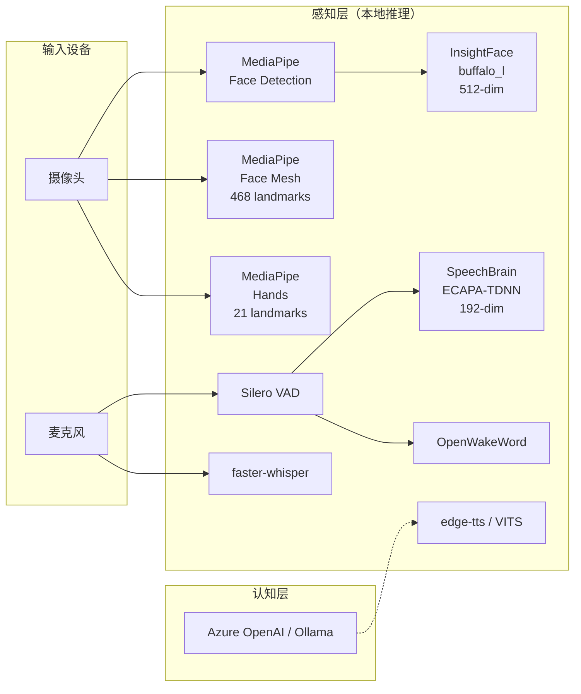

### 3.2 各模块详细选型

| 模块 | 选定模型/库 | 版本/规格 | 选型理由 | 放弃方案 |
|------|------------|-----------|---------|---------|
| **人脸检测** | MediaPipe Face Detector | CPU 实时 <10ms/帧 | Google 出品，CPU 即可运行，延迟极低，与后续 Face Mesh 同框架 | OpenCV Haar Cascade（精度低）、MTCNN（速度慢 50ms+） |
| **人脸识别** | InsightFace (buffalo_l) | 512 维嵌入，L2 归一化 | SOTA 开源人脸识别，ArcFace 损失函数，大规模训练数据 | FaceNet（精度略低）、DeepFace（依赖重） |
| **声纹识别** | SpeechBrain ECAPA-TDNN | 192 维嵌入 | 当前 SOTA 声纹模型（VoxCeleb 榜首），PyTorch 实现 | ResNetSE（ECAPA 的改进版，更优）、GE2E（效果一般） |
| **语音活动检测** | Silero VAD | v4.0，ONNX | 极轻量级，CPU 实时推理，噪声鲁棒性优秀 | WebRTC VAD（效果较差）、Voice Activity Detection (energy-based，不可靠) |
| **唤醒词** | OpenWakeWord | v0.4+ | 本地运行、支持自定义唤醒词、低误触发率 | Porcupine（商业授权限制）、Snowboy（已停止维护） |
| **语音转文字** | faster-whisper / Whisper.cpp | large-v3，CTranslate2 | 本地运行、多语言支持（中英文）、精度高 | 云端 STT（违反隐私要求）、Vosk（模型老旧） |
| **文字转语音** | edge-tts / VITS | — | edge-tts 免费、中文自然；VITS 可本地推理 | Azure TTS（云端）、eSpeak（效果差） |
| **视线/注视** | MediaPipe Face Mesh | 468 个面部特征点 | 与 Face Detection 同一框架，复用模型 | 专用 gaze 模型（需额外模型下载、维护成本高） |
| **手势识别** | MediaPipe Hands | 21 个手部关键点 | 与 Face Mesh 同一生态，推理快 | OpenPose（慢，不实时）、自定义 CNN（数据标注成本高） |
| **姿态估计（Phase 2）** | MediaPipe Pose (BlazePose) | 33 个身体关键点 | 与以上 MediaPipe 模块统一框架 | OpenPose（同样慢）、MoveNet（TensorFlow 依赖重） |
| **云 LLM（可选）** | Azure OpenAI / OpenAI API | GPT-4o / o1-mini | 通用最强、Function Calling 成熟 | Claude API（同样可用，取决于配置） |
| **本地 LLM 回退** | Ollama 代理 | 任意 GGUF 模型 | 统一管理本地模型、OpenAI 兼容接口 | 直接 llama.cpp（管理不便） |

### 3.3 模型推理流水线

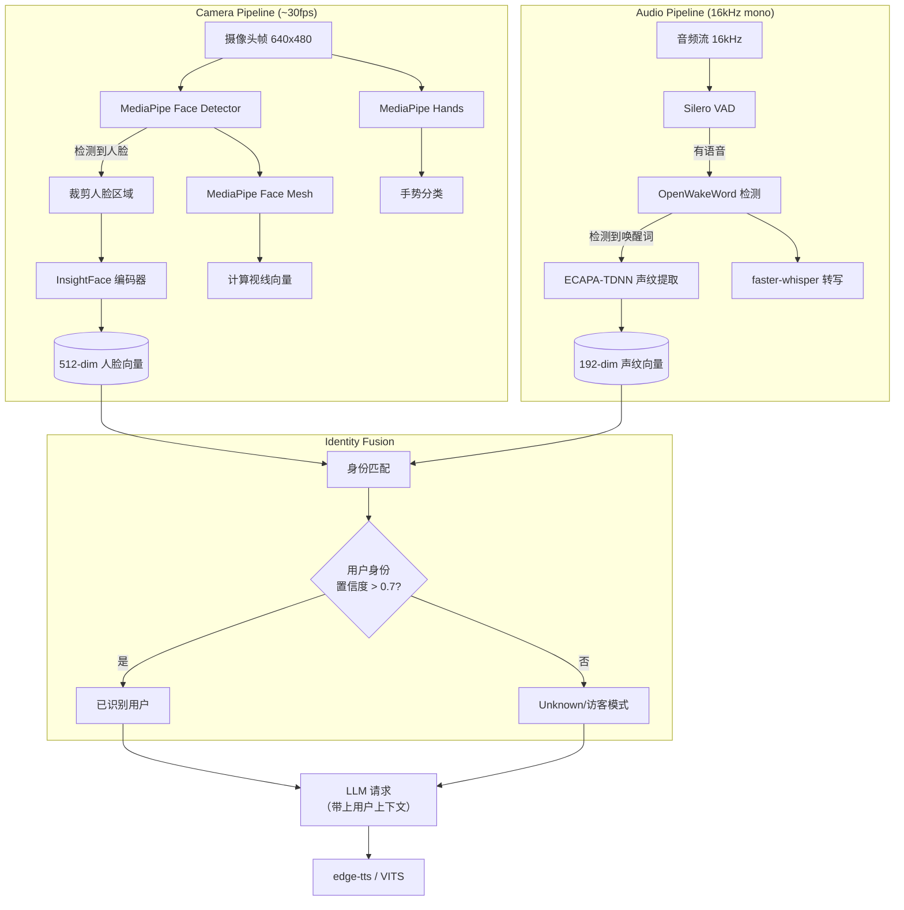

### 3.4 延迟预算

| 阶段 | 组件 | 延迟 | 备注 |
|------|------|------|------|
| 人脸检测 | MediaPipe | <10ms | CPU 实时 |
| 人脸编码 | InsightFace | ~30ms | GPU 加速 |
| 人脸关键点 | MediaPipe Face Mesh | <15ms | CPU 实时 |
| 声纹编码 | ECAPA-TDNN | ~50ms | 1.5 秒语音片段 |
| 语音检测 | Silero VAD | <5ms | 30ms 帧级检测 |
| 唤醒词检测 | OpenWakeWord | ~20ms | 每帧检测 |
| 语音转文字 | faster-whisper large-v3 | ~2s（5s 语音） | 实时率 ~0.4 |
| 文字转语音 | edge-tts | ~500ms | 首次连接 |
| LLM 推理 | GPT-4o | ~1-3s | 取决于复杂度 |
| LLM 推理（本地） | Ollama + Qwen2.5-7B | ~5-15s | 取决于硬件 |
| **总端到端（非 LLM）** | — | **<150ms** | 感知层 |
| **总端到端（含 LLM）** | — | **~1-4s** | 云端 LLM |

---

## 4. Python 推理服务依赖

### 4.1 核心依赖

```text
# 核心 AI 库
mediapipe>=0.10.0          # 人脸检测、Face Mesh、Hands、Pose
insightface>=0.7.3         # 人脸编码（buffalo_l 模型）
speechbrain>=1.0.0         # ECAPA-TDNN 声纹识别
silero-vad>=4.0            # 语音活动检测
openwakeword>=0.4.0        # 唤醒词检测
faster-whisper>=1.0.0      # 语音转文字
edge-tts>=6.0.0            # 文字转语音（免费）

# 数值计算库
numpy>=1.26.0
opencv-python>=4.9.0        # 图像处理
scipy>=1.12.0               # 信号处理、距离计算

# 通信
websockets>=12.0            # Electron 与 Python 间 WebSocket 通信
aiohttp>=3.9.0              # 异步 HTTP（用于健康检查、模型下载）

# 数据库（Python 侧）
# sqlite3 -- Python 内置，不需要额外安装

# 系统工具
psutil>=5.9.0               # 进程/资源监控
pywin32>=306                # Windows API 调用（仅 Windows）
comtypes>=1.4.0             # COM 接口（仅 Windows）
```

### 4.2 依赖分层

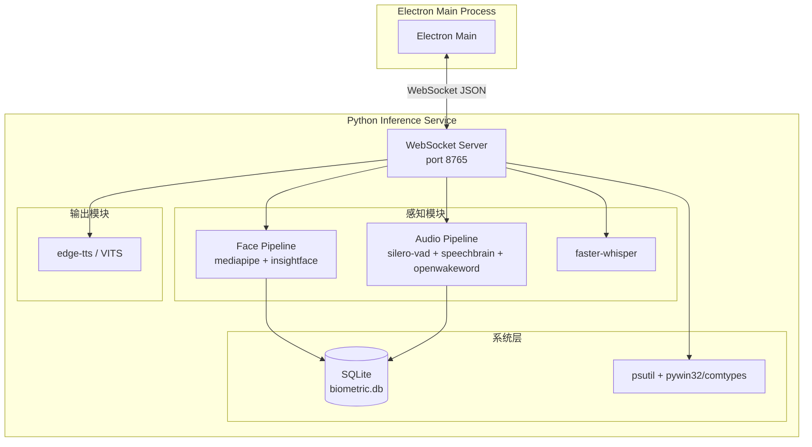

### 4.3 模型下载与缓存

- **首次启动**: Python 服务检测模型目录 `~/.frank/models/`，缺失时自动下载。
- **下载策略**: 使用 `aiohttp` 流式下载，显示进度条。
- **缓存路径**: `~/.frank/models/`（Windows: `%USERPROFILE%\.frank\models\`）。
- **总模型体积**: 约 5-8 GB（含 faster-whisper large-v3 ~3GB、InsightFace ~500MB 等）。
- **按需加载**: 非活跃模块释放显存/内存。

---

## 5. Electron 前端栈

### 5.1 技术选型

| 组件 | 技术/库 | 用途 |
|------|---------|------|
| 主进程 | Node.js 20+ LTS | 生命周期管理、系统托盘、自动启动 |
| 渲染进程 | HTML5 / CSS3 / JavaScript (ES2022) | 用户界面 |
| 打包 | electron-builder + NSIS | Windows 安装包制作 |
| WebSocket 客户端 | `ws` (Node.js 原生 WebSocket) | Electron ↔ Python 通信 |
| IPC | Electron contextBridge / ipcRenderer+ipcMain | 渲染进程 ↔ 主进程通信 |
| 波形可视化 | Web Audio API (AnalyserNode) | 麦克风实时波形 |
| 图形绘制 | Canvas API | 人脸框、关键点可视化 |
| 通知 | Electron Notification API | 系统通知 |
| 系统托盘 | Tray API | 后台常驻 |

### 5.2 进程架构

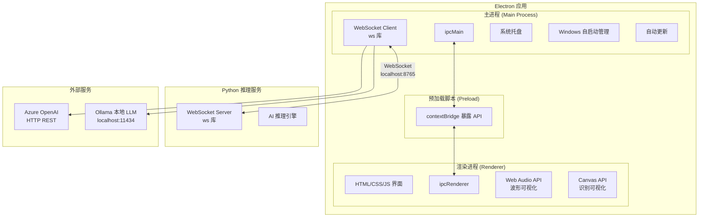

### 5.3 预加载 API 设计

```javascript
// contextBridge.exposeInMainWorld('frank', { ... })
// 渲染进程通过 window.frank 调用

window.frank = {
  // 用户识别
  identifyUser: () => Promise<UserInfo>,
  startFaceStream: (callback) => void,
  stopFaceStream: () => void,

  // 语音
  startVoiceCapture: (callbacks) => void,
  stopVoiceCapture: () => void,
  speak: (text) => Promise<void>,

  // 系统
  getSystemInfo: () => Promise<SystemInfo>,
  getDisplayInfo: () => Promise<DisplayInfo>,
  getAudioDevices: () => Promise<AudioDevice[]>,

  // LLM
  askLLM: (prompt, context) => Promise<string>,

  // 任务
  listTasks: () => Promise<Task[]>,
  createTask: (task) => Promise<Task>,
  updateTask: (id, updates) => Promise<Task>,

  // 配置
  getConfig: (key) => any,
  setConfig: (key, value) => void,
}
```

---

## 6. 本地存储

### 6.1 双数据库设计

Frank 使用**两个独立的 SQLite 数据库**以实现关注点分离和安全隔离。

| 数据库 | 路径 | 用途 | 访问方 | 安全级别 |
|--------|------|------|--------|---------|
| `frank.db` | `~/.frank/data/frank.db` | 任务列表、用户配置、聊天记录、设置 | Electron（better-sqlite3） | 一般 |
| `biometric.db` | `~/.frank/data/biometric.db` | 人脸向量、声纹向量、用户生物特征 | Python（sqlite3） | **高** |

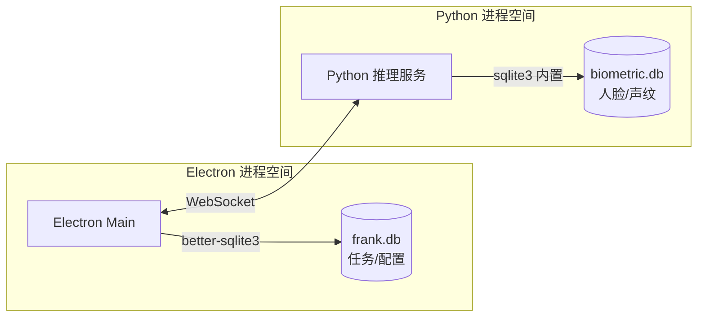

### 6.2 安全隔离措施

1. **进程隔离**: 生物特征数据库仅在 Python 进程中访问，Electron 主进程无法直接读取。
2. **接口限制**: Electron 仅能通过 WebSocket 请求"身份匹配"结果，无法获取原始向量数据。
3. **加密存储**: 向量数据使用 AES-256-GCM 加密存储（密钥由用户登录密码派生）。
4. **内存保护**: 使用完成后及时清除向量缓冲区，避免核心转储泄漏。

### 6.3 数据库 Schema 概要

**frank.db（Electron 侧）**:

```sql
-- 任务管理
CREATE TABLE tasks (
    id          TEXT PRIMARY KEY,
    user_id     TEXT NOT NULL,
    title       TEXT NOT NULL,
    description TEXT,
    priority    INTEGER DEFAULT 0,
    status      TEXT DEFAULT 'pending',
    due_date    TEXT,
    created_at  TEXT DEFAULT (datetime('now')),
    updated_at  TEXT DEFAULT (datetime('now'))
);

-- 用户配置
CREATE TABLE user_config (
    user_id   TEXT PRIMARY KEY,
    config    TEXT NOT NULL,  -- JSON
    updated_at TEXT DEFAULT (datetime('now'))
);

-- 聊天历史
CREATE TABLE chat_history (
    id         INTEGER PRIMARY KEY AUTOINCREMENT,
    user_id    TEXT NOT NULL,
    role       TEXT NOT NULL,  -- 'user' | 'assistant'
    content    TEXT NOT NULL,
    timestamp  TEXT DEFAULT (datetime('now'))
);

-- 应用设置
CREATE TABLE app_settings (
    key   TEXT PRIMARY KEY,
    value TEXT NOT NULL
);
```

**biometric.db（Python 侧）**:

```sql
-- 用户生物特征
CREATE TABLE users (
    id           TEXT PRIMARY KEY,
    name         TEXT NOT NULL,
    created_at   TEXT DEFAULT (datetime('now'))
);

-- 人脸嵌入（每个用户可注册多张）
CREATE TABLE face_embeddings (
    id         INTEGER PRIMARY KEY AUTOINCREMENT,
    user_id    TEXT NOT NULL REFERENCES users(id),
    embedding  BLOB NOT NULL,   -- 512 x float32, AES-GCM 加密
    quality    REAL,            -- 注册质量评分
    created_at TEXT DEFAULT (datetime('now'))
);

-- 声纹嵌入（每个用户可注册多条语音）
CREATE TABLE voice_embeddings (
    id         INTEGER PRIMARY KEY AUTOINCREMENT,
    user_id    TEXT NOT NULL REFERENCES users(id),
    embedding  BLOB NOT NULL,   -- 192 x float32, AES-GCM 加密
    duration   REAL,            -- 语音时长（秒）
    created_at TEXT DEFAULT (datetime('now'))
);

-- 身份识别日志
CREATE TABLE recognition_log (
    id         INTEGER PRIMARY KEY AUTOINCREMENT,
    user_id    TEXT,
    modality   TEXT NOT NULL,   -- 'face' | 'voice' | 'fusion'
    confidence REAL,
    created_at TEXT DEFAULT (datetime('now'))
);
```

---

## 7. 通信协议

### 7.1 通信拓扑

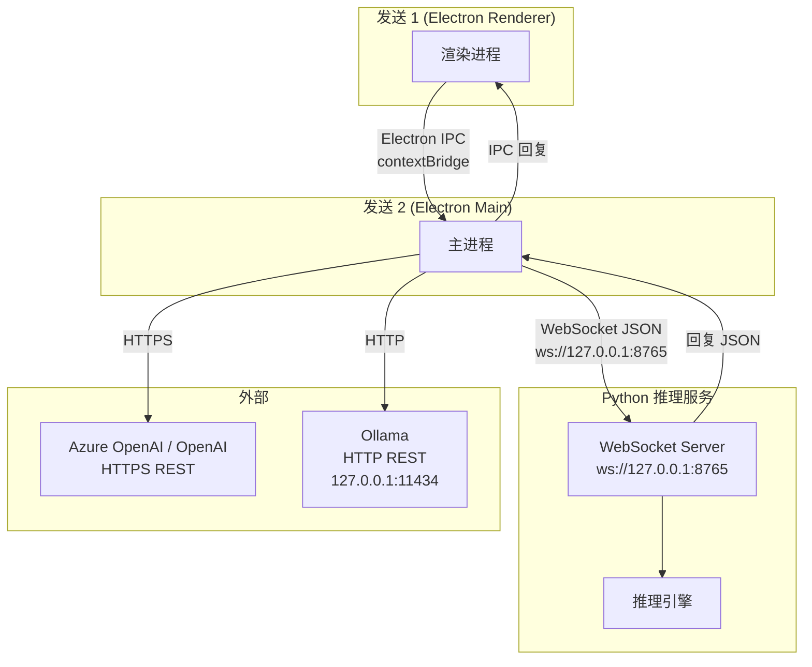

### 7.2 协议详情

#### WebSocket（Electron <-> Python）

| 属性 | 值 |
|------|-----|
| 传输 | TCP, 127.0.0.1:8765 |
| 协议 | WebSocket (RFC 6455) |
| 数据格式 | JSON (UTF-8) |
| 认证 | 内部连接 + 简单令牌（防止同机其他进程访问） |
| 心跳 | 5 秒间隔 ping/pong |
| 重连 | 指数退避：1s, 2s, 4s, 8s, ... max 30s |

**消息格式**:

```json
// 请求
{
  "id": "req_001",
  "method": "identify_face",
  "params": {
    "image_b64": "<base64 JPEG>",
    "timestamp": 1717027200000
  }
}

// 响应
{
  "id": "req_001",
  "result": {
    "user_id": "user_123",
    "name": "张三",
    "confidence": 0.921,
    "face_bbox": [120, 80, 240, 280]
  }
}

// 事件（主动推送）
{
  "event": "user_seen",
  "data": {
    "user_id": "user_123",
    "confidence": 0.88
  }
}

// 错误
{
  "id": "req_002",
  "error": {
    "code": -32000,
    "message": "Face detection failed: no face found"
  }
}
```

**方法列表**:

| 方法 | 方向 | 说明 |
|------|------|------|
| `identify_face` | E -> P | 传入图像帧，返回用户身份 |
| `register_face` | E -> P | 注册新用户人脸 |
| `identify_voice` | E -> P | 传入语音片段，返回用户身份 |
| `register_voice` | E -> P | 注册新用户声纹 |
| `start_speaking` | E -> P | 开始说话检测（连续推送用户事件） |
| `stop_speaking` | E -> P | 停止说话检测 |
| `transcribe` | E -> P | 转写语音片段为文字 |
| `speak` | E -> P | 文字转语音（返回音频流或文件路径） |
| `detect_wakeword` | E -> P | 唤醒词检测（持续推送） |
| `get_system_info` | E -> P | 获取系统信息（设备、进程、资源） |
| `health` | E -> P | 健康检查 |
| `user_seen` | P -> E | 主动推送：检测到用户 |
| `user_left` | P -> E | 主动推送：用户离开 |
| `wakeword_detected` | P -> E | 主动推送：唤醒词触发 |

#### Cloud LLM（Electron <-> OpenAI API）

- 使用 OpenAI 兼容的 REST API（HTTPS）。
- 默认端点：Azure OpenAI（配置灵活可换）。
- 回退端点：Ollama (`http://localhost:11434/v1/`)。
- Function Calling 用于工具调用（查询数据库、执行插件等）。

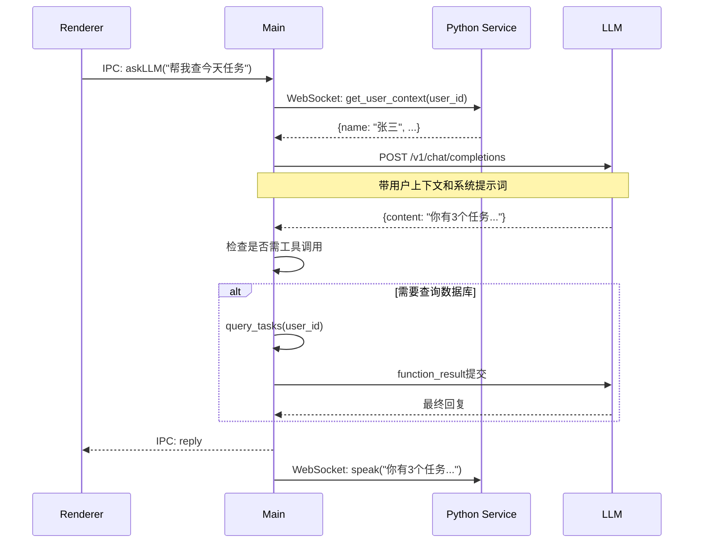

#### Electron IPC（Renderer <-> Main）

| 通道 | 方向 | 用途 |
|------|------|------|
| `frank:identify-user` | R -> M -> R | 触发身份识别并返回结果 |
| `frank:set-user` | R -> M | 手动切换用户 |
| `frank:start-camera` | R -> M -> R | 启动摄像头流（在主进程中打开） |
| `frank:stop-camera` | R -> M | 关闭摄像头 |
| `frank:speak` | R -> M | 播放语音 |
| `frank:ask-llm` | R -> M -> R | 请求 LLM |
| `frank:task-*` | R -> M -> R | 任务 CRUD |
| `frank:config-*` | R -> M -> M | 配置读写 |

---

## 8. 多输出设备访问

### 8.1 设备发现策略

| 设备类型 | 访问方式 | 备选方案 |
|---------|---------|---------|
| 显示器 | Electron `screen.getAllDisplays()` | — |
| 音频输出 | `node-core-audio` (NAPI) | Windows Power Shell `Get-AudioDevice -Playback` / Python `pywin32` |
| 音频输入 | `navigator.mediaDevices.enumerateDevices()`（渲染进程） | Electron `desktopCapturer.getSources()` |

### 8.2 多显示器管理

```mermaid
graph TD
    subgraph "Frank 窗口管理"
        M[Electron Main Process]
        SC[Screen API<br/>screen.getAllDisplays()]
    end

    subgraph "显示器拓扑 (示例)"
        D1[主显示器 2560x1440<br/>Frank 主窗口]
        D2[副显示器 1920x1080<br/>通知/状态浮窗]
        D3[竖屏显示器 1080x1920<br/>任务看板]
    end

    M -->|遍历| SC
    SC -->|显示器列表| M
    M -->|在指定显示器<br/>创建窗口| D1
    M -->|在指定显示器<br/>创建窗口| D2
    M -->|在指定显示器<br/>创建窗口| D3
```

### 8.3 音频设备枚举

```typescript
// TypeScript 伪代码 - Electron Main Process

enum AudioDeviceType {
  Playback, // 播放设备
  Capture,  // 录音设备
}

interface AudioDeviceInfo {
  id: string;
  name: string;
  type: AudioDeviceType;
  isDefault: boolean;
  channels: number;
}

// 主方案: node-core-audio (NAPI addon)
function enumerateAudioDevices(): AudioDeviceInfo[] {
  try {
    return nodeCoreAudio.getDevices();
  } catch {
    // 备选方案: Windows Power Shell
    return fallbackWindowsPowerShell();
  }
}

// Windows 备选: Power Shell
function fallbackWindowsPowerShell(): AudioDeviceInfo[] {
  const output = execSync(`
    Get-AudioDevice -Playback | Select-Object ID, Name, Default
  `);
  return parsePowerShellOutput(output);
}

// macOS 备选: 使用 AudioToolbox via child_process
// Linux 备选: 使用 PulseAudio pactl
```

---

## 9. 插件系统运行时

### 9.1 架构设计

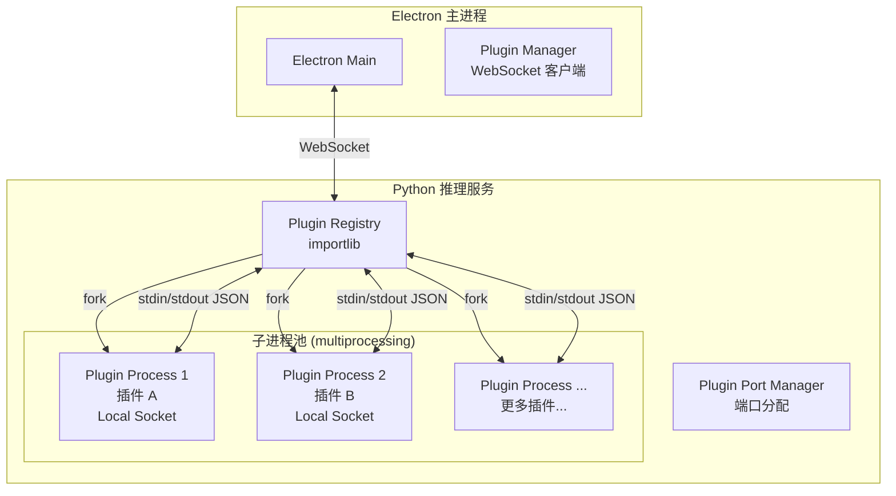

### 9.2 插件规范

每个插件是一个 Python 模块，预期暴露以下接口：

```python
# plugin_template.py - 插件模板

from frank.plugin import BasePlugin

class MyPlugin(BasePlugin):
    """插件元信息"""
    name = "my_plugin"
    version = "1.0.0"
    description = "我的插件"
    author = "Frank 社区"

    async def on_load(self):
        """插件加载时调用。初始化资源、连接等。"""
        pass

    async def on_unload(self):
        """插件卸载时调用。清理资源。"""
        pass

    async def handle_request(self, request: dict) -> dict:
        """
        处理来自主进程的请求。

        Args:
            request: {
                "method": str,        # 方法名
                "params": dict,       # 参数
                "id": str             # 请求 ID
            }

        Returns:
            {
                "result": any,        # 结果
                "id": str             # 对应请求 ID
            }
        """
        method = request["method"]
        params = request.get("params", {})

        if method == "my_action":
            return {"result": self.do_action(params)}

        raise ValueError(f"Unknown method: {method}")

    async def do_action(self, params):
        """插件具体逻辑"""
        return {"status": "ok", "data": params}
```

### 9.3 隔离与通信

| 属性 | 方案 |
|------|------|
| 进程隔离 | `multiprocessing.Process` |
| 通信 | stdin/stdout JSON lines (`\n` 分隔) |
| 健康检查 | 5 秒心跳，超时自动重启 |
| 资源限制 | `resource` 模块（Unix）/ Job Object（Windows, pywin32） |
| 崩溃恢复 | Supervisor 自动重启，最多 3 次/5 分钟 |
| 沙箱 | 可选：子进程使用 `subprocess` + `--safe` 模式（限制 `os.system`、`subprocess`） |

### 9.4 内置插件（Phase 1）

- **task_manager**: 任务管理（CRUD、提醒）
- **note_taker**: 快速笔记（语音转文字后自动创建）
- **screen_lock**: 基于身份识别的屏幕锁
- **presence_monitor**: 多用户进出检测、自动切换

---

## 10. 打包与分发

### 10.1 打包流程

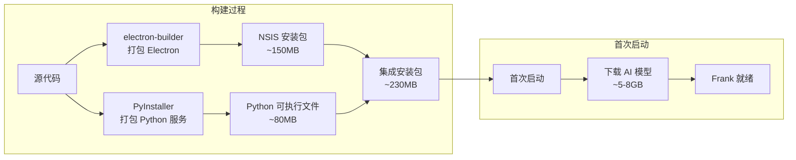

### 10.2 安装结构

```
目标安装目录 ← %LOCALAPPDATA%\Programs\Frank\
├── Frank.exe              # Electron 主程序
├── resources/
│   ├── app.asar           # Electron 应用代码
│   └── python-service/    # Python 推理服务
│       ├── frank-service.exe  # PyInstaller 打包
│       └── config.yaml
└── ...

用户数据目录 ← %USERPROFILE%\.frank\
├── data/
│   ├── frank.db           # 任务/配置数据库
│   └── biometric.db       # 生物特征数据库（加密）
├── models/                # AI 模型缓存（首次下载）
│   ├── insightface/
│   ├── speechbrain/
│   ├── silero-vad/
│   ├── openwakeword/
│   └── faster-whisper/
├── logs/                  # 日志
├── plugins/               # 用户安装的插件
└── config.yaml            # 用户配置
```

### 10.3 分发策略

| 渠道 | 方法 | 频率 |
|------|------|------|
| Windows 安装包 | electron-builder + NSIS | 每次发行版 |
| 自动更新 | electron-updater + GitHub Releases | 增量更新 |
| Windows 自启动 | 注册表 `HKCU\Software\Microsoft\Windows\CurrentVersion\Run` | 安装时配置 |
| AI 模型 | 首次启动时自动下载（CDN / GitHub Releases） | 仅首次 |

### 10.4 版本号规范

遵循语义化版本号: `vMAJOR.MINOR.PATCH`。

- **MAJOR**: 不兼容的架构性变更（如改通信协议、换数据库等）。
- **MINOR**: 向下兼容的功能新增（如新增插件类型、新增 AI 模块）。
- **PATCH**: 向下兼容的 Bug 修复、性能优化。

---

## 11. 开发环境

### 11.1 环境要求

| 工具 | 版本 | 备注 |
|------|------|------|
| Node.js | 20+ LTS | 运行 Electron |
| npm | 10+ | Node.js 包管理 |
| Python | 3.11+ | 推理服务开发 |
| uv 或 pip | 最新 | Python 包管理（推荐 uv 加速） |
| Git | 2.40+ | 版本控制 |
| VS Code | 最新 | 推荐 IDE |

### 11.2 代码规范

| 语言 | 规范工具 | 关键规则 |
|------|---------|---------|
| JavaScript / TypeScript | ESLint + Prettier | Airbnb 风格（自定义） |
| Python | Ruff | 兼容 Black + isort |
| Commit 消息 | — | [Conventional Commits](https://www.conventionalcommits.org/) |

### 11.3 目录结构

```
frank/
├── electron/                  # Electron 前端
│   ├── src/
│   │   ├── main/              # 主进程
│   │   ├── renderer/          # 渲染进程
│   │   └── preload/           # 预加载脚本
│   ├── package.json
│   └── electron-builder.yml
├── python/                    # Python 推理服务
│   ├── frank_service/         # 主服务
│   │   ├── pipelines/         # 推理流水线
│   │   ├── identity/          # 身份识别
│   │   ├── audio/             # 音频处理
│   │   └── server/            # WebSocket 服务
│   ├── plugins/               # 插件系统
│   ├── tests/
│   ├── pyproject.toml
│   └── requirements.txt
├── docs/                      # 文档
│   └── superpowers/specs/     # 技术规范
├── scripts/                   # 构建/工具脚本
└── README.md
```

### 11.4 开发工作流

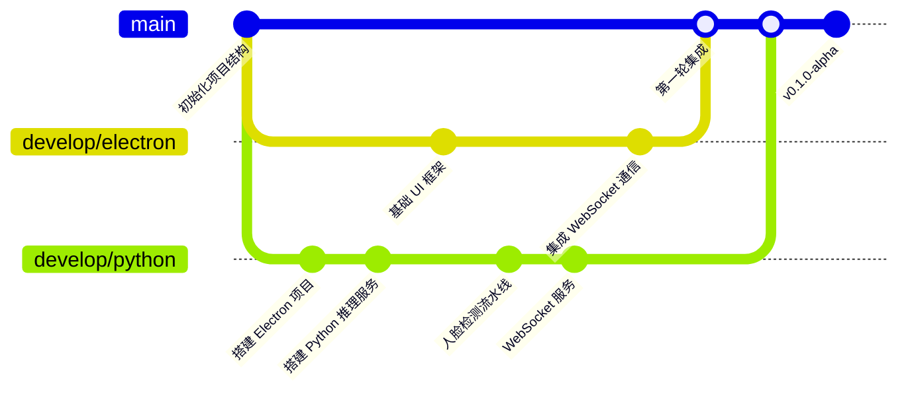

### 11.5 持续集成（未来 Phase）

- **GitHub Actions**: 自动化测试 + 构建安装包。
- **pre-commit hooks**: ESLint + Ruff 检查。
- **单元测试**: Jest (Electron 侧) + pytest (Python 侧)。

---

## 12. 整体架构图

### 12.1 分层架构总览

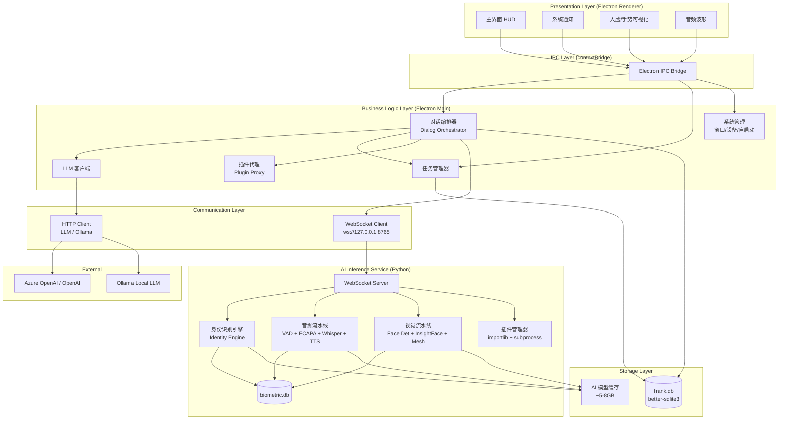

### 12.2 数据流示例：用户进门

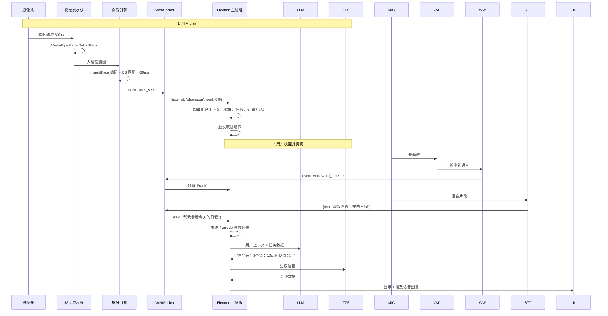

---

## 13. 附录：决策记录

### ADR-001: 为什么选择 WebSocket 而不是 gRPC 或 REST？

| 协议 | 延迟 | 双向推送 | 跨语言 | 选型 |
|------|------|---------|--------|:----:|
| WebSocket | 低 | 原生支持 | 好 | **选定** |
| gRPC | 低 | Server Streaming | 好（需代码生成） | 放弃 |
| REST | 中 | 仅轮询 | 好 | 放弃 |

**理由**: 音频流和身份事件需要持续双向推送，WebSocket 是天然最适合的方案，且 Python 和 Node.js 都有成熟的 `websockets` 库。gRPC 需要 `.proto` 代码生成，调试不如 WebSocket 灵活。

### ADR-002: 为什么不用单一数据库？

Electron 侧用 `better-sqlite3`，Python 侧用内置 `sqlite3`，两者独立数据库。

**理由**: 关注点分离。生物特征数据是高敏感信息，隔离在 Python 进程内可防止 Electron 渲染进程通过 IPC 路径意外泄漏。同时两个进程的操作模式不同（Python 是同步批处理，Electron 是异步 CRUD），混合到一个数据库会增加锁定冲突风险和复杂性。

### ADR-003: 为什么不用 TypeScript？

当前选定使用纯 JavaScript。**决策暂缓到 Phase 2**。

- 团队对 JS 熟悉度高，快速原型阶段 TypeScript 的静态检查收益不明显。
- 项目规模还不大（初期约 5-8 个渲染页面），类型系统引入的构建配置和类型定义成本高于收益。
- Phase 2 可以考虑逐步迁移（`// @ts-check` JSDoc 注解 → 渐进式 TS 文件）。

### ADR-004: 为什么 Python 推理服务用 PyInstaller 打包而不直接分发源码？

- 用户环境不可控（Python 版本、系统 DLL、显卡驱动），PyInstaller 打包为一个可执行文件，消除环境依赖。
- 保护 AI 流水线代码（反编译难度 > 直接源码分发）。
- 模型下载逻辑在运行时完成，安装包不包含大模型文件。

### ADR-005: 为什么边缘——tts 而不用 Azure TTS？

**edge-tts** 免费、中文自然度高、API 简单。Azure TTS 效果更好但需要云端 API 调用，增加延迟和成本，且需要网络连接。Frank 的核心理念是本地优先，edge-tts 符合这个理念。如果需要更高精度，可以配置为 VITS 本地模型。

### ADR-006: 内存目标 200MB 是否合理？

经评估：
- Electron 自身基线约 120-150MB（一个主进程 + 一个渲染进程）。
- Python 推理服务（纯推理状态，未加载大模型）约 40-60MB。
- 合计约 **180-210MB**，目标 200MB 基本可达。
- 大模型（Whisper large-v3 ~3GB 加载后）仅在需要 STT 时加载，使用后释放。

---

> **文档结束**
>
> 本文档版本历史：
> | 版本 | 日期 | 修改内容 | 作者 |
> |------|------|---------|------|
> | 1.0 | 2026-05-30 | 初稿 | 架构组 |
